# <center> Lista 1 - Casa e Sala </center>

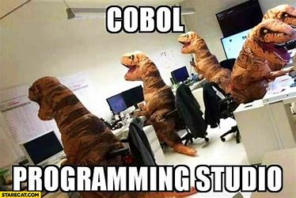

Aqui contém, meus queridos, minhas queridas, a primeira lista de exercícios de programação que eu fiz na minha vida, resolvidas em Python e em C. Ainda me dá arrepios só de lembrar que portugol e diagrama de blocos são coisas que existem e que eu ainda passei um bom tempo esquentando a cabeça com elas...

# <center> Índice </center>
- <a href="#casa">Casa</a>
    - <a href="#exercício-1">Exercício 1</a>
    - <a href="#exercício-2">Exercício 2</a>
    - <a href="#exercício-3">Exercício 3</a>
    - <a href="#exercício-4">Exercício 4</a>
    - <a href="#exercício-5">Exercício 5</a>
    - <a href="#exercício-6">Exercício 6</a>
    - <a href="#exercício-7">Exercício 7</a>
    - <a href="#exercício-8">Exercício 8</a>
    - <a href="#exercício-9">Exercício 9</a>
    - <a href="#exercício-10">Exercício 10</a>
    - <a href="#exercício-11">Exercício 11</a>
    - <a href="#exercício-12">Exercício 12</a>
    - <a href="#exercício-13">Exercício 13</a>
- <a href="#sala">Sala</a>
    - <a href="#exercício-1-1">Exercício 1</a>
    - <a href="#exercício-1-2">Exercício 2</a>
    - <a href="#exercício-1-3">Exercício 3</a>
    - <a href="#exercício-1-4">Exercício 4</a>
    - <a href="#exercício-1-5">Exercício 5</a>
    - <a href="#exercício-1-6">Exercício 6</a>
    - <a href="#exercício-1-7">Exercício 7</a>

# <center> Casa </center>

## Exercício 1

### Enunciado:

Crie um programa que permita fazer a conversão cambial entre Reais e Dólares.

Considere como taxa de câmbio US$1,00 = R$2,40. Leia um valor em Reais pelo 
teclado e mostre o correspondente em Dólares.

### Resolução em Python

#### Código

```py
r = float(input("R$ = "))
print ("R$ {:.2f} = US$ {:.2f}" .format(r, r / 2.4))
```

#### Output

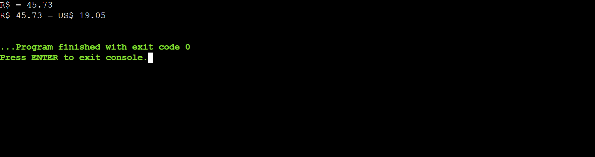

### Resolução em C

#### Código

```c
# include <stdio.h>

int main() {

    float real;
    printf ("R$ = ");
    scanf ("%f", &real);
    printf ("R$ %.2f = US$ %.2f\n", real, real / 2.4);

    return 0;
}
```

#### Output

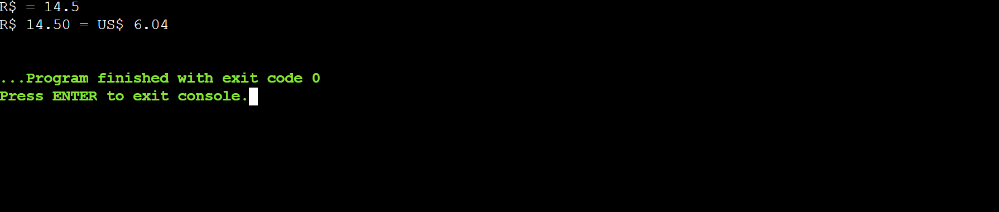

## Exercício 2

### Enunciado:

Crie um programa que permita fazer a conversão cambial entre Dólares e Reais. 
Considere como taxa de câmbio US$1,00 = R$2,40. Leia um valor em Dólares pelo 
teclado e mostre o correspondente em Reais.

### Resolução em Python

#### Código

```py
d = float(input("US$ = "))
print ("US$ {:.2f} = R$ {:.2f}" .format(d, d * 2.4))
```

#### Output

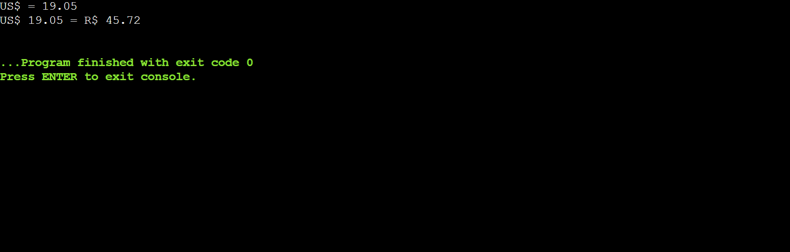

### Resolução em C

#### Código

```c
#include <stdio.h>

int main() {

    float dolar;
    printf ("US$ = ");
    scanf ("%f", &dolar);
    printf ("US$ %.2f = R$ %.2f", dolar, dolar * 2.4);

    return 0;
}
```

#### Output

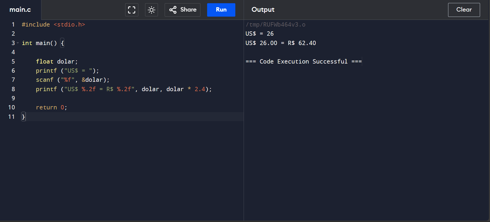

## Exercício 3

### Enunciado:

Calcule quantos azulejos são necessários para azulejar uma parede. É necessário 
conhecer a altura da parede (AP), a sua largura (LP), e a altura do azulejo (AA) e sua 
largura (LA). Leia os dados através do teclado.

### Resolução em Python

#### Código

```py
print ("\nVossa senhoria precisará de {:.2f} azulejos" .format((float(input("Altura da parede (em cm): ")) * float(input("Largura da parede (em cm): "))) / (float(input("Altura do azulejo (em cm): ")) * float(input("Largura do azulejo (em cm): ")))))
```

#### Output

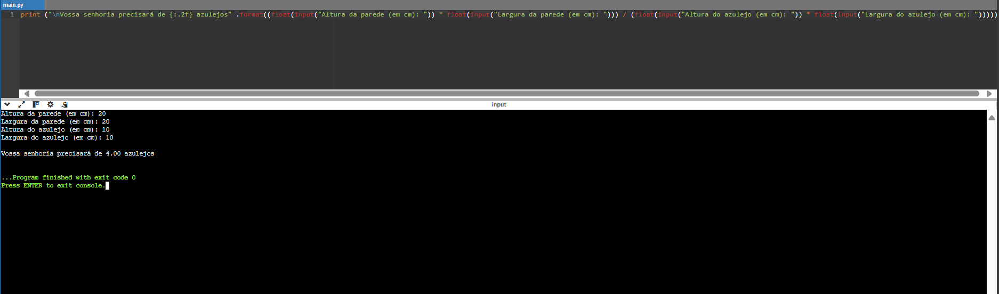

### Resolução em C

#### Código

```c
# include <stdio.h>

int main() {

    float dados[4];
    printf ("Altura da parede (em cm): ");
    scanf ("%f", &dados[0]);
    printf ("Largura da parede (em cm): ");
    scanf ("%f", &dados[1]);
    printf ("Altura do azulejo (em cm): ");
    scanf ("%f", &dados[2]);
    printf ("Largura do azulejo (em cm): ");
    scanf ("%f", &dados[3]);
    printf ("Vossa senhoria precisará de %.2f azulejos\n", (dados[0] * dados[1]) / (dados[2] * dados[3]));

    return 0;
}
```

#### Output

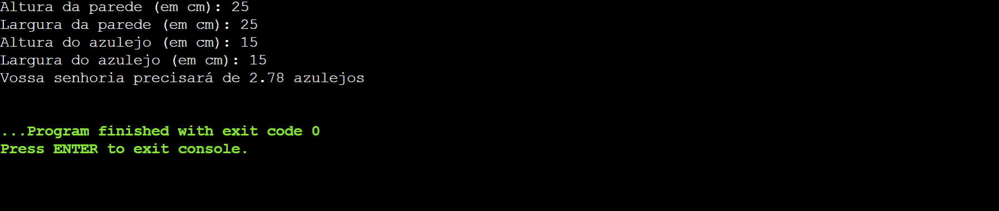

## Exercício 4

### Enunciado:

Faça um programa que, a partir das medidas dos lados de um retângulo, lidos via 
teclado, calcule a área e o perímetro deste retângulo.

A = a.b
P = 2.a + 2.b

### Resolução em Python

#### Código

```py
print ("Entre com dois lados adjacentes do retângulo (base e altura): ")
a = float(input("Base (em cm) = "))
b = float(input("Altura (em cm) = "))
print ("\nÁrea = {:.2f} cm²\nPerímetro = {:.2f} cm" .format(a * b, a * 2 + b * 2))
```

#### Output

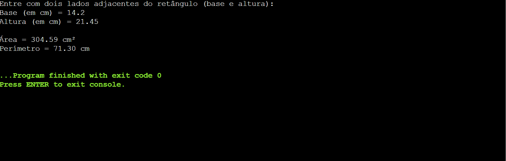

### Resolução em C

#### Código

```c
#include <stdio.h>

int main() {

    float a, b;
    printf ("Entre com dois lados adjacentes do retângulo (base e altura):\n");
    printf ("Base (em cm) = ");
    scanf ("%f", &a);
    printf ("Altura (em cm) = ");
    scanf ("%f", &b);
    printf ("Área = %.2f cm²\nPerímetro = %.2f cm\n", a * b, a * 2 + b * 2);

    return 0;
}
```

#### Output

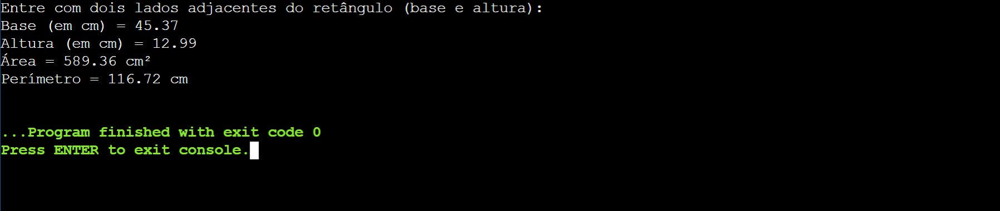

## Exercício 5

### Enunciado

A condição física de uma pessoa pode ser medida com base no cálculo do IMC,
Índice de Massa Corporal, o qual é calculado dividindo-se a massa da pessoa ( em kg) 
pela altura da mesma (h em m) elevada ao quadrado (IMC= m/h²). Escreva um 
programa que leia a massa e a altura de uma pessoa, calcule e mostre o IMC.

### Resolução em Python

#### Código

```py
print ("\nIMC = {:.2f}" .format(float(input("Massa (em kg): ")) / float(input("Altura (em m): ")) ** 2))
```

#### Output

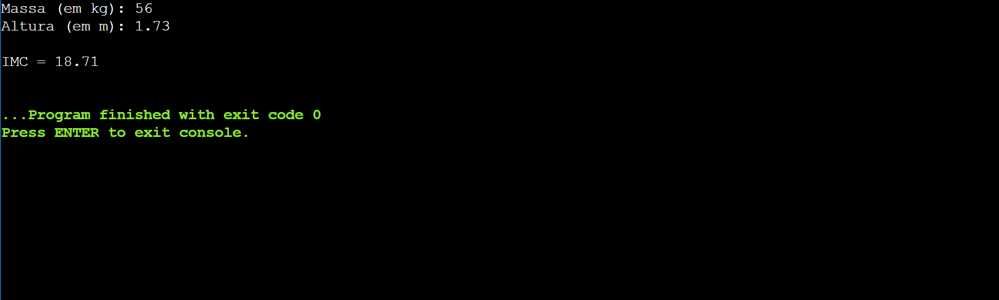

### Resolução em C

#### Código

```c
#include <stdio.h>

int main() {

    float m, h;
    printf ("Massa (em kg): ");
    scanf ("%f", &m);
    printf ("Altura (em m): ");
    scanf ("%f", &h);
    printf ("IMC = %.2f\n", m / (h * h));

    return 0;
}
```

#### Output

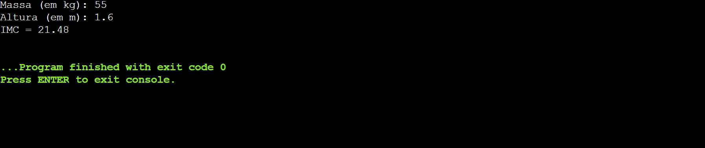

## Exercício 6

### Enunciado:

Dado o valor do raio (r) de uma circunferência, elaborar um programa para calcular 
e imprimir sua área (A) e o seu comprimento (C). A fórmula da área do círculo é A = πr² 
e do comprimento é C = 2πr.

### Resolução em Python

#### Código

```py
import math
r = float(input("Raio (em cm): "))
print ("\nÁrea = {:.2f} cm²\nComprimento = {:.2f} cm" .format(math.pi * r ** 2, 2 * math.pi * r))
```

#### Output

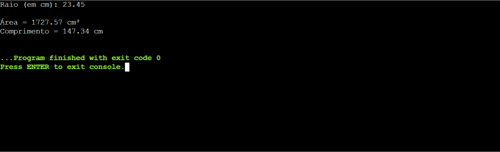

### Resolução em C

#### Código

```c
#include <stdio.h>
#include <math.h>

int main() {

    float r;
    printf ("Raio (em cm): ");
    scanf ("%f", &r);
    printf ("Área = %.2f cm²\nComprimento = %.2f cm", M_PI * pow(r, 2), 2 * M_PI * r);

    return 0;
}
```

#### Output

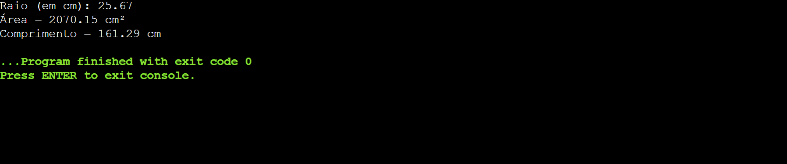

## Exercício 7

### Enunciado:

Elaborar um programa para calcular e exibir o volume (V) de uma esfera e a área 
(A) de sua superfície, dado o valor de seu raio (R). A fórmula do volume da esfera é 
V = (4/3)πR³ e da área é A = 4πR².

### Resolução em Python

#### Código

```py
import math
r = float(input("Raio (em cm): "))
print ("Volume = {:.2f} cm³\nÁrea = {:.2f} cm²" .format((4 / 3) * math.pi * r ** 3, 4 * math.pi * r ** 2))
```

#### Output

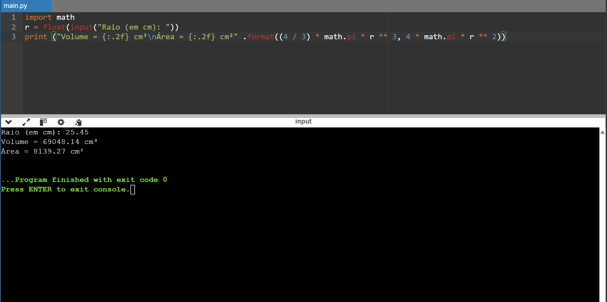

### Resolução em C

#### Código

```c
#include <stdio.h>
#include <math.h>

int main() {

    float r;
    printf ("Raio (em cm): ");
    scanf ("%f", &r);
    printf ("Volume = %.2f cm³\nÁrea = %.2f cm²\n", (4 / 3) * M_PI * pow(r, 3), 4 * M_PI * pow(r, 2));

    return 0;
}
```

#### Output

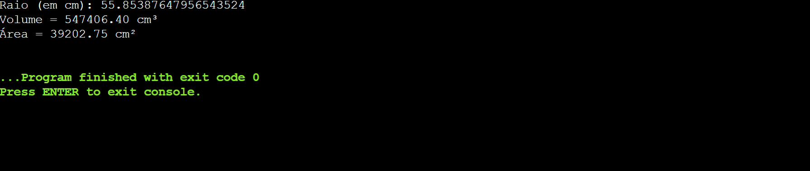

## Exercício 8

### Enunciado:

Faça um programa para calcular a média final de um aluno, supondo-se que há
quatro notas bimestrais durante o ano e que esta é calculada através de uma média 
aritmética simples (todos os bimestres têm o mesmo peso).

### Resolução em Python

#### Código

```py
print ("\nMédia final = {:.2f}" .format((float(input("Entre com o valor das notas:\nN1 = ")) + float(input("N2 = ")) + float(input("N3 = ")) + float(input("N4 = "))) / 4))
```

#### Output

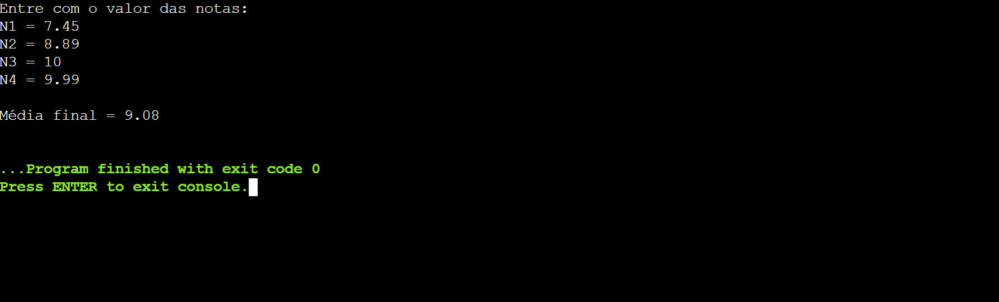

### Resolução em C

#### Código

```c
#include <stdio.h>

int main() {

    float notas[4];
    printf ("Entre com as notas:\n");
    for (int i = 1; i <= 5; i++) {
        printf ("N%d = ", i);
        scanf ("%f", &notas[i - 1]);
    }
    printf ("Média final = %.2f", (notas[0] + notas[1] + notas[2] + notas[3]) / 4);

    return 0;
}
```

#### Output

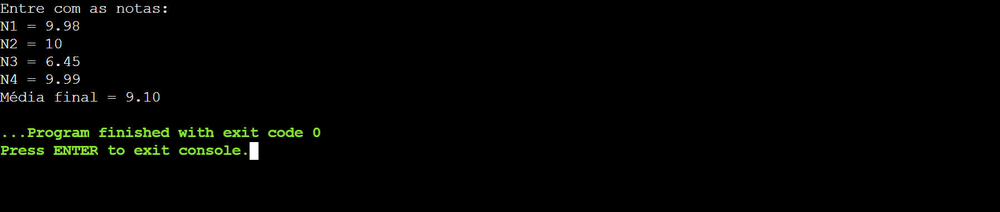

## Exercício 9

### Enunciado:

O critério de avaliação semestral de determinada escola segue a regra:
P1 – primeira avaliação do semestre.
P2 – segunda avaliação do semestre.
Ativ – nota atribuída pelas atividades realizadas no semestre.

Média = (P1 x 4 + P2 x 4 + Ativ x 2) / 10

Escreva um programa que leia as notas das provas (P1 e P2) e da atividade (Ativ),
calcule e mostre a média, seguindo o cálculo acima.

### Resolução em Python

#### Código

```py
print ("\nMédia = {:.2f}" .format((float(input("Entre com o valor da notas:\nP1 = ")) * 4 + float(input("P2 = ")) * 4 + float(input("Ativ = ")) * 2) / 10))
```

#### Output

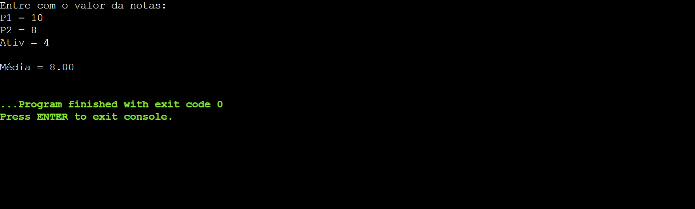

### Resolução em C

#### Código

```c
#include <stdio.h>

int main() {

    float dados[3];
    printf ("Entre com as notas:\n");
    printf ("P1: ");
    scanf ("%f", &dados[0]);
    printf ("P2: ");
    scanf ("%f", &dados[1]);
    printf ("Ativ: ");
    scanf ("%f", &dados[2]);
    printf ("Média = %.2f\n", (dados[0] * 4 + dados[1] * 4 + dados[2] * 2) / 10);

    return 0;
}
```

#### Output

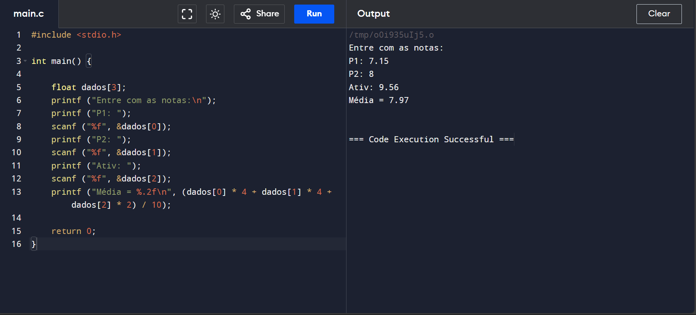

## Exercício 10

### Enunciado:

Elaborar um programa para receber valores, via teclado, nas variáveis "a" e "b". 
Após isto, o programa, utilizando-se de uma 3a. variável "c", deverá trocar o conteúdo 
das variáveis "a" e "b".

### Resolução em Python

#### Código

```py
a = float(input("A = "))
b = float(input("B = "))
c = a
a = b
b = c
print ("A = {:.2f}\nB = {:.2f}" .format(a, b))
```

#### Output

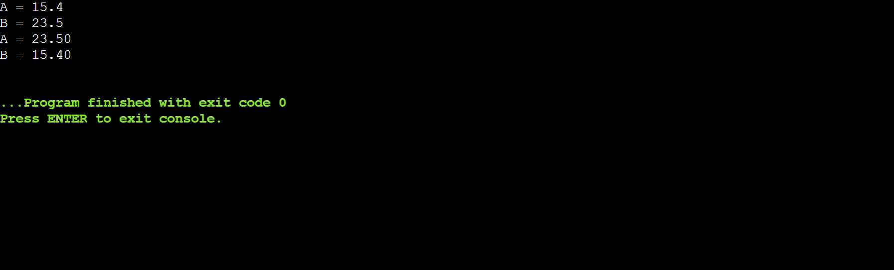

### Resolução em C

#### Código

```c
#include <stdio.h>

int main() {

    float a, b, c;
    printf ("A = ");
    scanf ("%f", &a);
    printf ("B = ");
    scanf ("%f", &b);
    c = a;
    a = b;
    b = c;
    printf ("\nA = %.2f\nB = %.2f\n", a, b);

    return 0;
}
```

#### Output

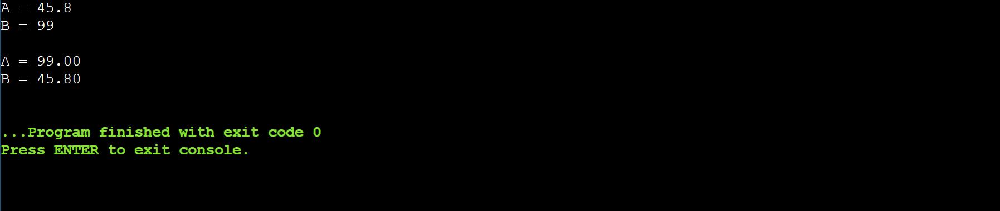

## Exercício 11

### Enunciado:

(DESAFIO) Idem o programa anterior, sem utilizar-se de uma 3a. variável.

### Resolução em Python

#### Código

```py
a = float(input("A = "))
b = float(input("B = "))
a, b = b, a
print ("A = {:.2f}\nB = {:.2f}" .format(a, b))
```

#### Output

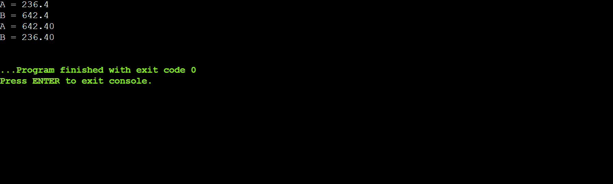

### Resolução em C

#### Código

```c
#include <stdio.h>

int main() {

    float a, b;
    printf ("A = ");
    scanf ("%f", &a);
    printf ("B = ");
    scanf ("%f", &b);
    a += b;
    b = a - b;
    a -= b;
    printf ("\nA = %.2f\nB = %.2f\n", a, b);

    return 0;
}
```

#### Output

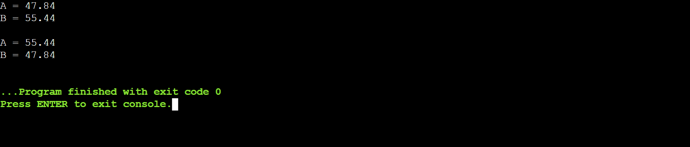

## Exercício 12

### Enunciado:

Elaborar um programa que receba, via teclado, os valores do espaço percorrido e 
do tempo gasto por um veículo em movimento, para calcular e apresentar em tela sua 
velocidade média.

### Resolução em Python

#### Código

```py
print ("Velocidade média = {:.2f} km/h" .format(float(input("Espaço percorrido (em km): ")) / float(input("Tempo gasto (em h): "))))
```

#### Output

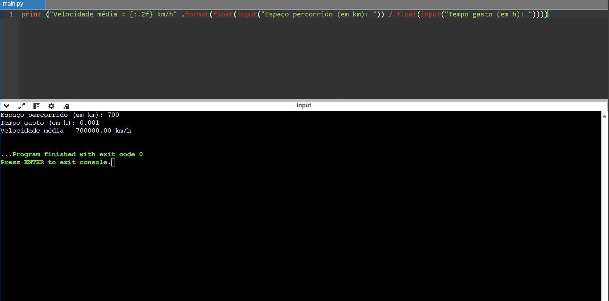

### Resolução em C

#### Código

```c
#include <stdio.h>

int main() {

    float tempo, espaco;
    printf ("Espaço (em km): ");
    scanf ("%f", &espaco);
    printf ("Tempo (em h): ");
    scanf ("%f", &tempo);
    printf ("Velocidade média = %.2f km/h\n", espaco / tempo);

    return 0;
}
```

#### Output

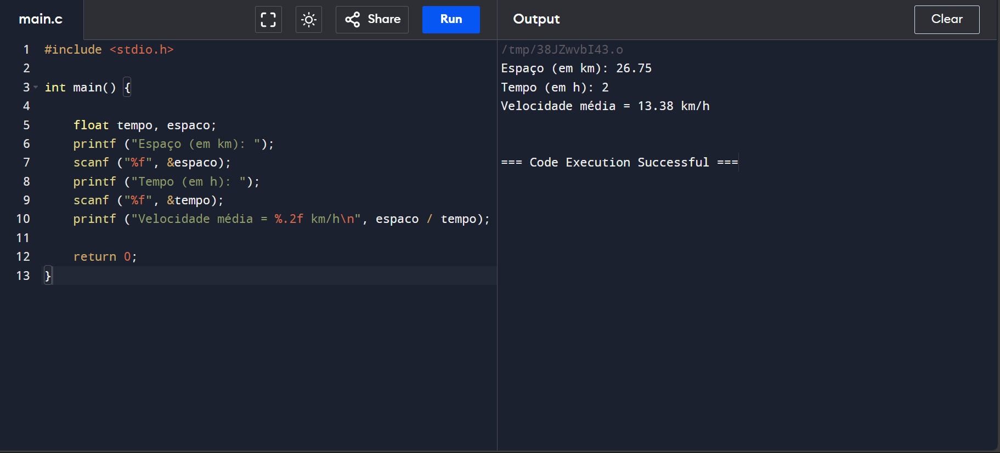

## Exercício 13

### Enunciado:

Num laboratório de física, em uma experiência de Movimento Uniformemente
Variado, foram encontrados os seguintes valores: s0=2m, v0=3m/s, a=10m/s2.
Digitado o valor de t (segundos), apresentar em tela o valor de s (metros). Dada a
fórmula:
s = s0 + v0 . t + ½ . a . t²

### Resolução em Python

#### Código

```py
seg = float(input('Segundos (t) = '))
print ("Metros (s) = {:.2f}" .format(2 + 3 * seg + 0.5 * 10 * seg ** 2))
```

#### Output

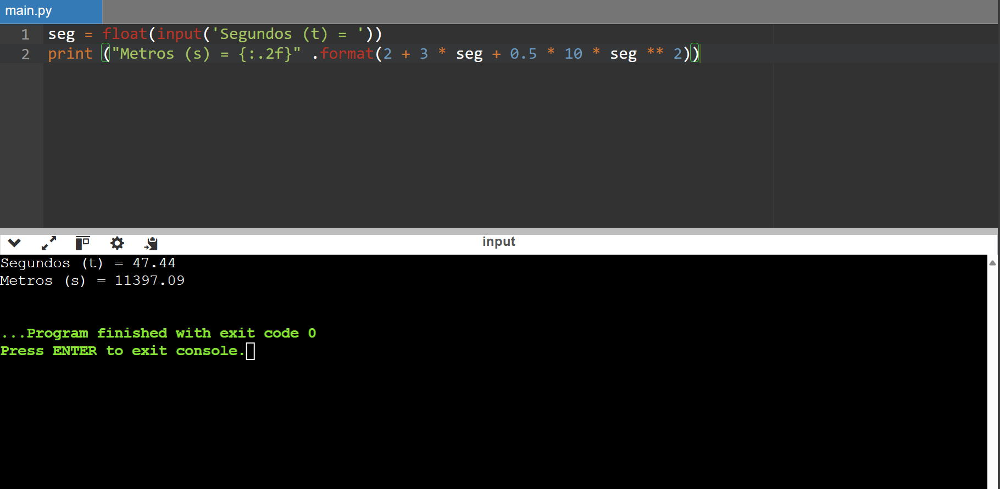

### Resolução em C

#### Código

```c
#include <stdio.h>

int main() {

    float seg;
    printf ("Segundos (t) = ");
    scanf ("%f", &seg);
    printf ("Metros (s) = %.2f\n", 2 + 3 * seg + 0.5 * 10 * (seg * seg));

    return 0;
}
```

#### Output

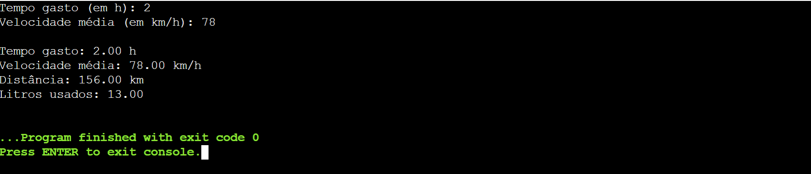

# <center> Sala </center>

## Exercício 1

### Enunciado

Calcular a quantidade de litros de combustível gasta numa viagem, utilizando-se um automóvel que faz 12Km por litro. Para obter o cálculo, o usuário deverá 
fornecer o tempo gasto na viagem e a velocidade média durante a mesma. Assim, 
será possível calcular a distância percorrida com a fórmula: DISTÂNCIA <-
TEMPO * VELOCIDADE. Tendo o valor da distância, calcule a quantidade de litros 
de combustível usada na viagem com a fórmula: LITROS_USADOS <-
DISTÂNCIA / 12. O programa deverá exibir os valores da velocidade média, tempo 
gasto na viagem, a distância percorrida e a quantidade de litros usada na viagem.

### Resolução em Python

#### Código

```py
dados = {'Tempo gasto (em h):' : float(input('Tempo gasto (em h): ')), 'Velocidade média (em km/h):': float(input('Velocidade média (em km/h): '))}
dados.update({'Distância (em km):': dados['Tempo gasto (em h):'] * dados['Velocidade média (em km/h):']})
dados.update({'Litros usados:' : dados['Distância (em km):'] / 12})
print ('')
for i in dados:
    print (i, "{:.2f}" .format(dados[i]))
```

#### Output

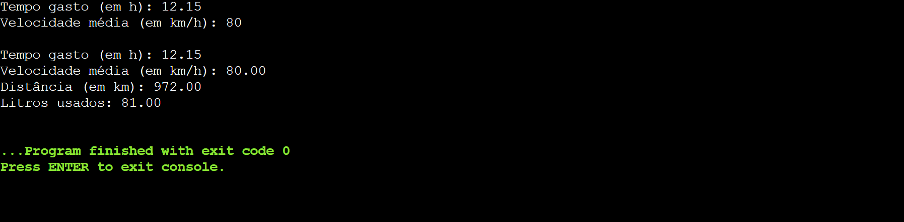

### Resolução em C

#### Código

```c
#include <stdio.h>

int main() {

    float dados[4];
    printf ("Tempo gasto (em h): ");
    scanf("%f", &dados[0]);
    printf ("Velocidade média (em km/h): ");
    scanf("%f", &dados[1]);
    dados[2] = dados[0] * dados[1];
    dados[3] = dados[2] / 12;
    printf ("\nTempo gasto: %.2f h\n", dados[0]);
    printf ("Velocidade média: %.2f km/h\n", dados[1]);
    printf ("Distância: %.2f km\n", dados[2]);
    printf ("Litros usados: %.2f\n", dados[3]);

    return 0;
}
```

#### Output

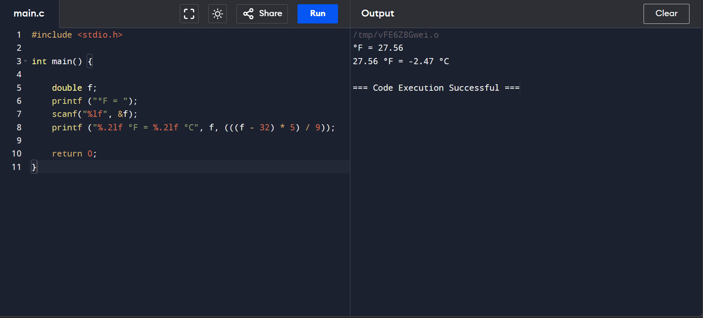

## Exercício 2

### Enunciado

Ler uma temperatura em graus Fahrenheit e exibi-la convertida em graus 
Centígrados, com a fórmula: C <- (((F-32) * 5) / 9), onde F é a temperatura em 
Fahrenheit e C em Centígrados

### Resolução em Python

#### Código

```py
f = float(input('°F = '))
print ("{:.2f} °F = {:.2f} °C" .format(f, ((f - 32) * 5) / 9))
```

#### Output

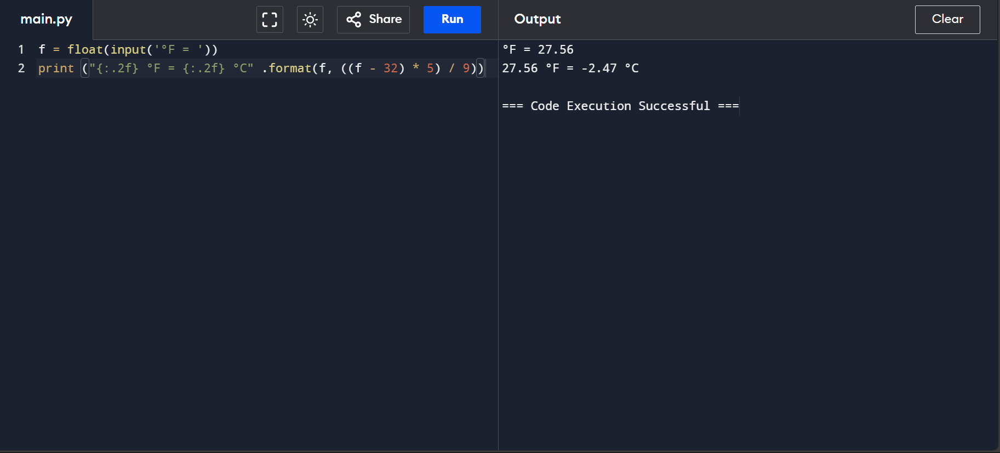

### Resolução em C

#### Código

```c
#include <stdio.h>

int main() {

    double f;
    printf ("°F = ");
    scanf("%lf", &f);
    printf ("%.2lf °F = %.2lf °C", f, (((f - 32) * 5) / 9));

    return 0;
}
```

#### Output


## Exercício 3

### Enunciado

Calcular e exibir o valor do volume de uma lata de óleo, usando a fórmula: 
VOLUME <- 3.14159 * R * R * ALTURA.

### Resolução em Python

#### Código

```py
print ("Volume = {:.2f} cm³" .format(3.14159 * float(input('Raio (em cm): ')) ** 2 * float(input('Altura (em cm): '))))
```

#### Output

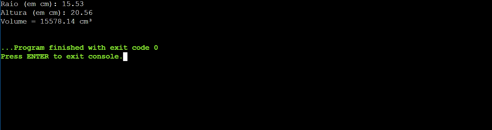

### Resolução em C

#### Código

```c
#include <stdio.h>

int main() {

    float dados[2];
    printf ("Raio (em cm): ");
    scanf ("%f", &dados[0]);
    printf ("Altura (em cm): ");
    scanf ("%f", &dados[1]);
    printf ("Volume = %.2f cm³\n", 3.14159 * dados[0] * dados[0] * dados[1]);

    return 0;
}
```

#### Output

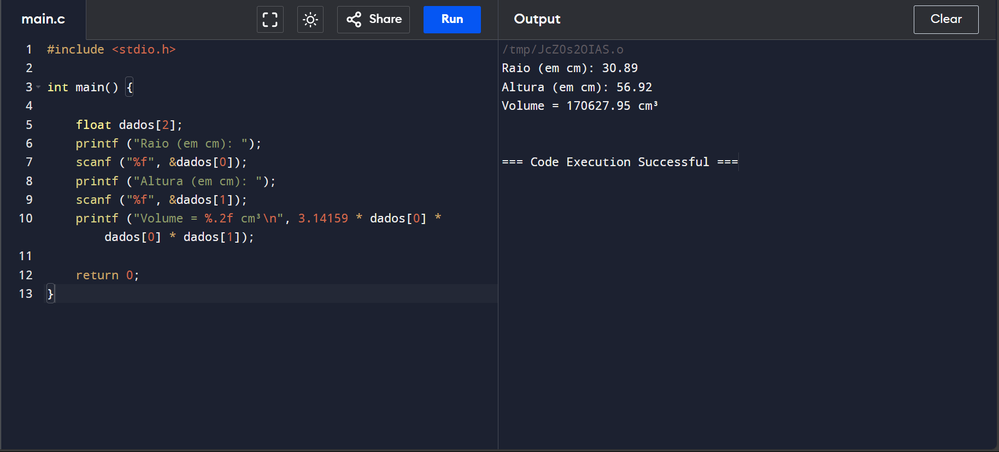

## Exercício 4

### Enunciado

Ler dois valores A e B, efetuar a troca dos mesmos de forma que a variável A 
passe a ter o valor da variável B e vice-versa. Exibir os valores trocados.

### Resolução em Python

#### Código

```py
a = float(input("A = "))
b = float(input("B = "))
c = a
a = b
b = c
print ("A = {:.2f}\nB = {:.2f}" .format(a, b))
```

#### Output

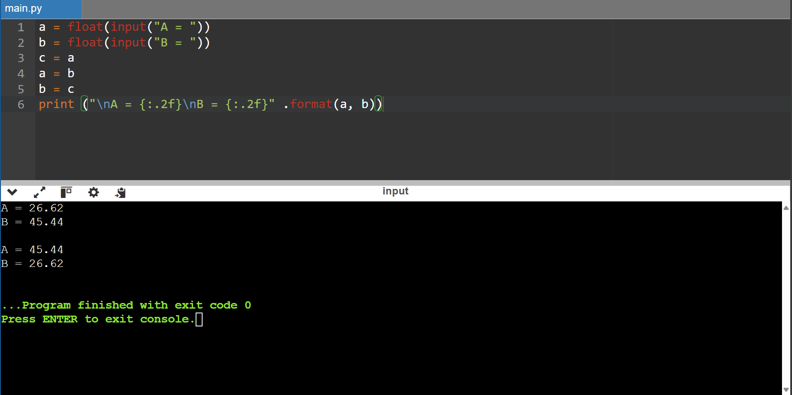

### Resolução em C

#### Código

```c
#include <stdio.h>

int main() {

    float a, b, c;
    printf ("A = ");
    scanf ("%f", &a);
    printf ("B = ");
    scanf ("%f", &b);
    c = a;
    a = b;
    b = c;
    printf ("\nA = %.2f\nB = %.2f\n", a, b);

    return 0;
}
```

#### Output


## Exercício 5

### Enunciado

Ler um número inteiro e exibir o resultado do quadrado dele mesmo

### Resolução em Python

#### Código

```py
print ("X² = {:.2f}" .format(float(input("X = ")) ** 2))
```

#### Output

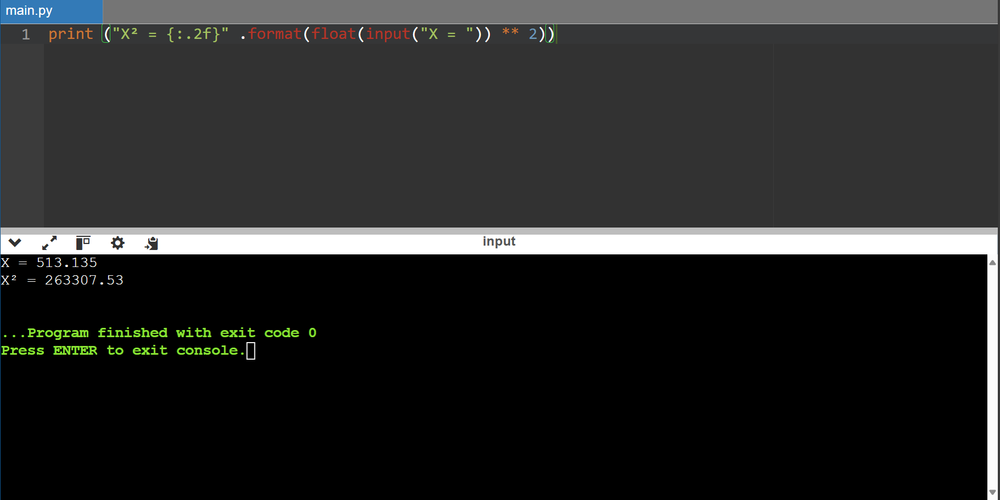

### Resolução em C

#### Código

```c
#include <stdio.h>

int main() {

    double x;
    printf ("X = ");
    scanf ("%lf", &x);
    printf ("X² = %.2lf\n", x * x);

    return 0;
}
```

#### Output

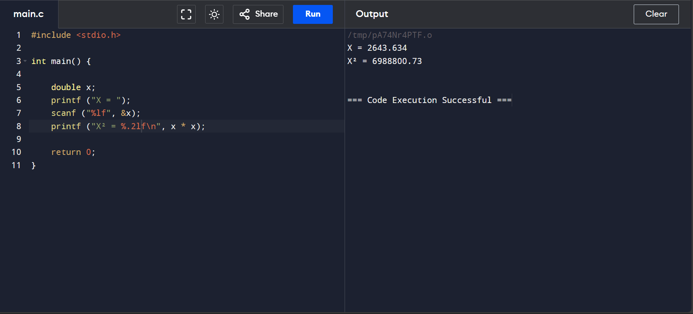

## Exercício 6

### Enunciado

Calcular o valor de uma prestação em atraso, usando a fórmula: PRESTAÇÃO 
<- VALOR + (VALOR * (TAXA / 100) * TEMPO).

### Resolução em Python

#### Código

```py
valor = float(input('Valor (em R$): ')); print ("Prestação = R$ {:.2f}" .format(valor + (valor * (float(input('Taxa (em %): ')) / 100)) * float(input('Tempo (em meses): '))))
```

#### Output

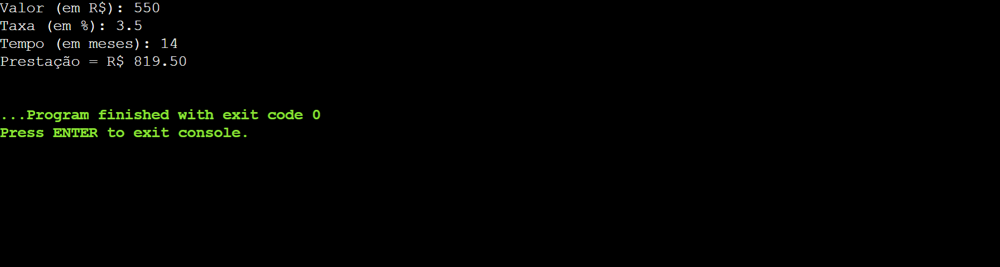

### Resolução em C

#### Código

```c
#include <stdio.h>

int main() {

    float dados[3];
    printf ("Valor (em R$): ");
    scanf ("%f", &dados[0]);
    printf ("Taxa (em %%): ");
    scanf ("%f", &dados[1]);
    printf ("Tempo (em meses): ");
    scanf ("%f", &dados[2]);
    printf ("Prestação = R$ %.2f\n", dados[0] + (dados[0] * (dados[1] / 100)) * dados[2]);

    return 0;
}
```

#### Output

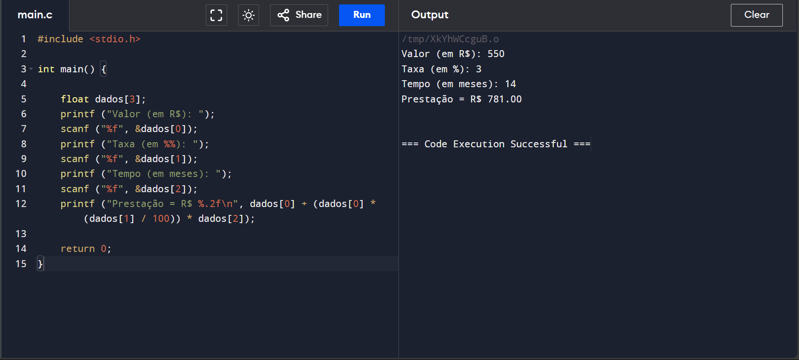

## Exercício 7

### Enunciado

Uma loja petshop precisa de um programa para calcular os custos de criação 
de coelhos. O custo é calculado com a fórmula: CUSTO <- (NR_COELHOS * 0.70) 
/18 + 10. O programa deve ler o valor para a variável NR_COELHOS e exibir o 
valor da variável CUSTO.

### Resolução em Python

#### Código

```py
print ("Custo de criação = R$ {:.2f}" .format((int(input('Nº de coelhos: ')) * 0.7) / 18 + 10))
```

#### Output

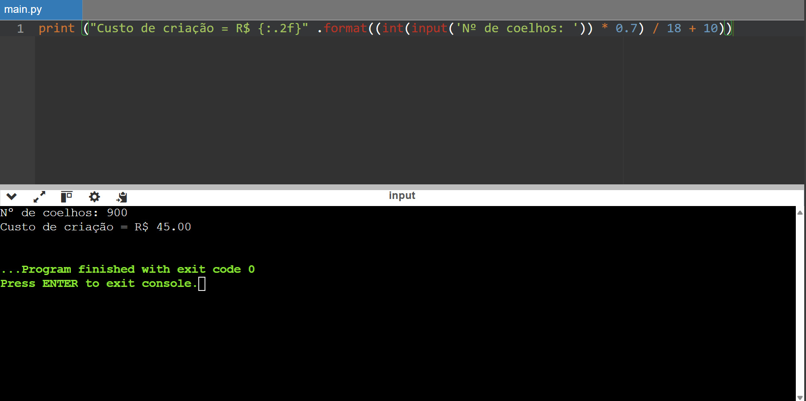

### Resolução em C

#### Código

```c
#include <stdio.h>

int main() {

    int coelho;
    printf ("Nº de coelhos = ");
    scanf ("%d", &coelho);
    printf ("Custo de criação = R$ %.2f\n", (coelho * 0.7) / 18 + 10);

    return 0;
}
```

#### Output

