# <center> Lista 2 - Casa e Sala</center>

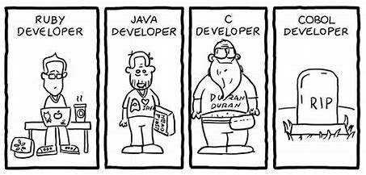

Bem vindo(a) à Lista 2 resolvida em Python e em C.

As novidades daqui são:

- Masterização do if/elif/else e match/case;
- Uso do mod (%);
- Processos mais rebustos.

Aqui a coisa fica mais séria, lembro-me de ter enchido o caderno com diagramas de bloco e algoritmos bizarros para contemplar todos os casos dos exercícios do tipo 'ordene 5279361028057 números em ordem crescente' na época que eu nem sonhava na mais remota existência do .sort(). 

# <center> Índice </center>
- <a href="#casa">Casa</a>
    - <a href="#exercício-1">Exercício 1</a>
    - <a href="#exercício-2">Exercício 2</a>
    - <a href="#exercício-3">Exercício 3</a>
    - <a href="#exercício-4">Exercício 4</a>
    - <a href="#exercício-5">Exercício 5</a>
    - <a href="#exercício-6">Exercício 6</a>
    - <a href="#exercício-7">Exercício 7</a>
- <a href="#sala">Sala</a>
    - <a href="#exercício-1-1">Exercício 1</a>
    - <a href="#exercício-2-1">Exercício 2</a>
    - <a href="#exercício-3-1">Exercício 3</a>
    - <a href="#exercício-4-1">Exercício 4</a>
    - <a href="#exercício-5-1">Exercício 5</a>
    - <a href="#exercício-6-1">Exercício 6</a>
    - <a href="#exercício-7-1">Exercício 7</a>
    - <a href="#exercício-8">Exercício 8</a>
    - <a href="#exercício-9">Exercício 9</a>
    - <a href="#exercício-10">Exercício 10</a>

# <center> Casa </center>

## Exercício 1

### Enunciado

Elaborar um programa em que informe se o número digitado pelo usuário é par ou 
impar.

### Resolução em Python

```py
print ("Entre com um número, eu sendo um mago da matemática, irei ponderar acerca da paridade do número em questão, alegando se o mesmo é par ou ímpar:\n")
if int(input("Nº = ")) % 2 == 0:
    print ("Par")
else:
    print ("Ímpar")
```

#### Código

#### Output

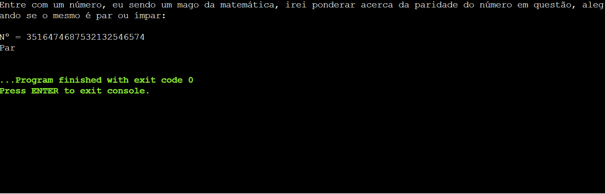

### Resolução em C

#### Código

```c
#include <stdio.h>

int main() {
    
    int n;
    printf ("Entre com um número, eu, sendo um mágico da matemática, irei dizer se ele é par ou ímpar: ");
    scanf ("%d", &n);
    if (n % 2 == 0) {
        printf ("%d é par, meu nobríssimo usuário :)\n", n);
    }
    else {
        printf ("%d é ímpar, meu caríssimo colega :)\n", n);
    }
    
    return 0;
}
```

#### Output


## Exercício 2

### Enunciado

Digitado um número inteiro entre 0 e 100, informar o quanto ele está distante de um 
determinado número chave, carregado no próprio programa. Ex.: Número chave=20, 
número digitado=15, resposta=5. Número chave=17, número digitado=20, resposta=3 
(Obs.: a resposta deverá ser sempre um número positivo).

### Resolução em Python

#### Código

```py
print ("Entre com um número entre 0 e 100 e eu direi o quão distante ele está do nosso número chave, que é 13:\n")
n = int(input("Nº = "))
print (n - 13) if n >= 13 else print ((n - 13) *-1)
```

#### Output

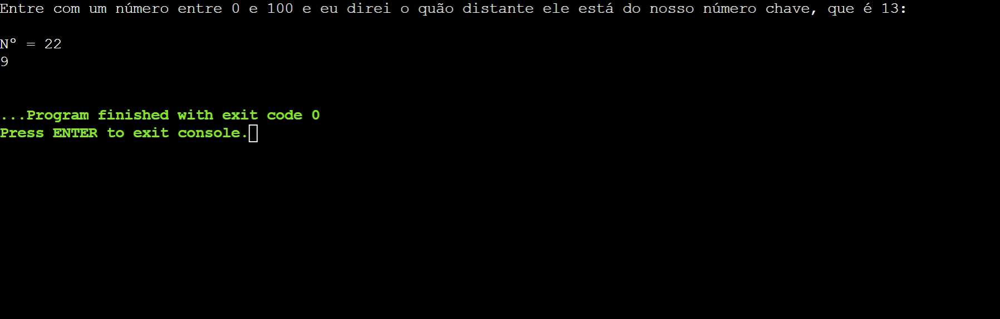

### Resolução em C

#### Código

```c
#include <stdio.h>

int main() {
    
    int n;
    printf ("Bem-vindo à brincadeira, nobríssimo usuário.\nA brincadeira consiste em você entrar com um número entre 0 e 100; desta maneira, eu, sendo um mestre da aritmética, irei te dizer o quão distante tal número está do nosso número chave :)\nNúmero chave = 22\n");
    printf ("Número digitado = ");
    scanf ("%d", &n);
    if (n < 22) {
        printf ("Resposta = %d :)\n", 22 - n);    
    }
    else {
        printf ("Resposta = %d :)\n", n - 22);
    }
    
    return 0;
}
```

#### Output


## Exercício 3

### Enunciado

Uma Universidade tem problemas com arredondamento das médias dos alunos, 
pois cada professor estipula um critério de arredondamento. Devemos elaborar um 
programa, em Linguagem C++, para a secretaria da Universidade, resolvendo esse 
problema. O programa deve solicitar uma nota e fazer o devido arredondamento.
Regras:
Notas que ultrapassem 0,5 de resto serão arredondas para CIMA.
Ex: 4,6 –>5,0
Notas que abaixo ou igual a 0,5 de resto serão arredondas para BAIXO.
Ex: 4,5 –> 4,0

### Resolução em Python

#### Código

```py
print("Nota arredondada = %d" % round(float(input("Nota = "))))
```

#### Output

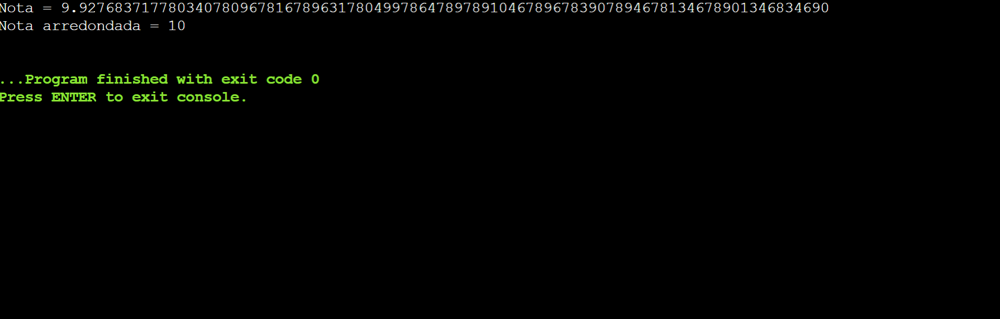

quando eu não sabia da existência desta criação divina que é o round, eu tive que transcender no raciocínio lógico para fazer manualmente o arredondamento, em portugol ainda! Em Python ficaria algo assim:

```py
n = float(input("Nota = "))
if n * 10 % 10 >= 5:
    print ("Nota arredondada =", n + 1 - n * 10 % 10 / 10)
else:
    print ("Nota arredondada =", n - n * 10 % 10 / 10)
```

### Resolução em C

#### Código

```c
#include <stdio.h>
#include <math.h>

int main() {
    
    float n;
    printf ("Nota = ");
    scanf ("%f", &n);
    printf ("Nota arredondada = %.0f\n", round(n));
    
    return 0;
}
```

#### Output


## Exercício 4

### Enunciado

Faça um programa que leia 3 números e exiba:
- a) O maior número;
- b) O menor número;
- c) O número do meio.

### Resolução em Python

#### Código

```py
nums = [int(input("Entre com números, que eu vou os dispor em ordem crescente:\nN1 = ")), int(input("N2 = ")), int(input("N3 = "))]
nums.sort()
print ("\nMenor = %d\nNº do meio = %d\nMaior = %d" % (nums[0], nums[1], nums[2]))
```

#### Output

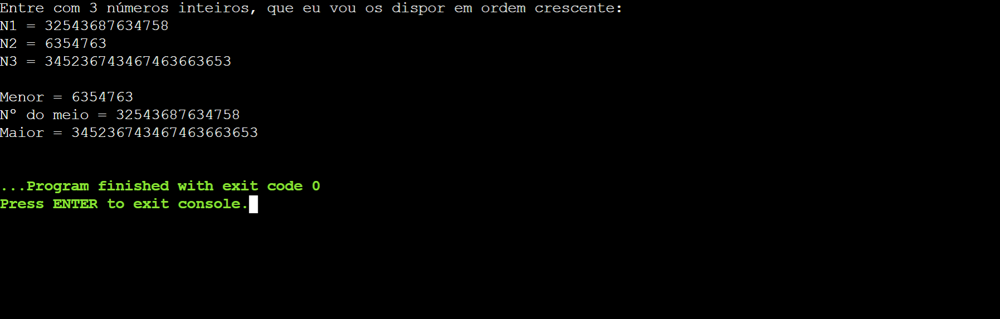

### Resolução em C

#### Código

```c
#include <stdio.h>

int main() {
    
    float a, b, c;
    printf ("Vossa senhoria deverá entrar com números, eu, sendo um mago da aritmética, deverei dizer qual deles é o maior, o menor, e o do meio.\n");
    printf ("1º número: ");
    scanf ("%f", &a);
    printf ("2º número: ");
    scanf ("%f", &b);
    printf ("3º número: ");
    scanf ("%f", &c);
    if (a > b && a > c) {
        printf ("Maior = %.2f\n", a);
    }
    else if (a > b && b < c || a > c && c < b) {
        printf ("Nº do meio = %.2f\n", a);
    }
    else {
        printf ("Menor = %.2f\n", a);
    }
    if (b > a && b > c) {
        printf ("Maior = %.2f\n", b);
    }
    else if (b > a && a < c || b > c && c < a) {
        printf ("Nº do meio = %.2f\n", b);
    }
    else {
        printf ("Menor = %.2f\n", b);
    }
    if (c > a && c > b) {
        printf ("Maior = %.2f\n", c);
    }
    else if (c > a && a < b || c > b && b < a) {
        printf ("Nº do meio = %.2f\n", c);
    }
    else {
        printf ("Menor = %.2f\n", c);
    }
    
    
    return 0;
}
```

#### Output


## Exercício 5

### Enunciado

Faça o programa que calcule o salário líquido dos funcionários de uma empresa. O 
salário líquido é composto por descontos e adicionais, seguindo as seguintes regras:

<b>Descontos</b>:

- Salário bruto < 800,00 – não realizar nenhum desconto;
- 800,00 <= Salário bruto <=1600,00 – descontar 8% de Imposto de Renda e 5
% de encargos;
- Salário bruto > 1600,00 – descontar 15% de Imposto de Renda e 7% de encargos.

<b>Adicionais</b>:

Caso o funcionário tenha trabalhado mais de 160 horas no mês, divida o seu salário 
bruto por 160 (representa horas trabalhadas) e calcule 50% de adicional nas horas 
que excederam a 160.
O usuário deverá digitar o salário bruto e o número de horas trabalhadas no mês de 
cada funcionário, e deverá receber como resultado o salário líquido. O usuário poderá 
calcular salário para N funcionários, para finalizar o programa o usuário deverá digitar 
0 no salário bruto, ao finalizar o programa exibir o total geral dos salários líquidos.

### Resolução em Python

#### Código

```py
total = 0
while True:
    sal = float(input("\nSalário bruto = "))
    total += sal
    if sal == 0:
        print ("Salário líquido total = %.2f" % total)
        break
    h = float(input("Horas trabalhadas = "))
    ant = sal
    if sal >= 800 and sal <= 1600:
        sal -= sal * (0.08 + 0.05)
    elif sal > 1600:
        sal -= sal * (0.15 + 0.07)
    if h > 160:
        sal += (ant / 160) * 0.5 * (h - 160)
    print ("Salário líquido = R$ %.2f" % sal)
```

#### Output

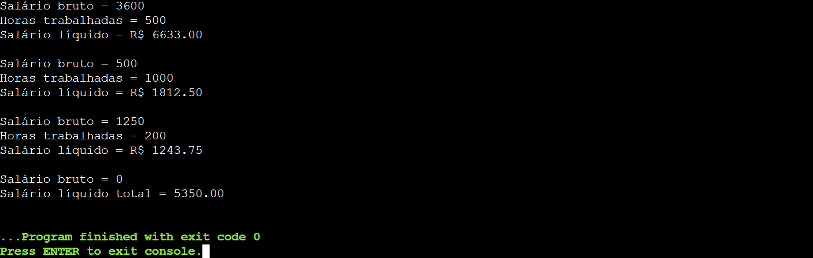

### Resolução em C

#### Código

```c
#include <stdio.h>
#include <stdbool.h>

int main() {

    float h, sal, total;

    while (true) {

        printf ("Salário bruto = ");
        scanf ("%f", &sal);
        if (sal == 0) {
            printf ("Salário total = %.2f\n", total);
            break;
        }
        printf ("Horas trabalhadas = ");
        scanf ("%f", &h);
        int ant = sal;
        if (sal >= 800 && sal <= 1600) {
            sal -= 0.08 * sal + 0.05 * sal;
        }
        else if (sal > 1600) {
            sal -= 0.15 * sal + 0.07 * sal;
        }
        if (h > 160) {
            sal += (ant / 160) * 0.5 * (h - 160);
        }
        printf ("Salário líquido = R$ %.2f\n\n", sal);
        total += sal;
    }

    return 0;
}
```

#### Output


## Exercício 6

### Enunciado

Faça um programa que receba como entrada o mês (de 1 a 12) e retorne o nome 
do respectivo mês. 

### Resolução em Python

#### Código

tava com preguiça de usar match/case ou if/elif, aí eu tasquei tudo num dicionário KKKK

```py
meses = {1: "Janeiro", 2: "Fevereiro", 3: "Março", 4: "Abril", 5: "Maio", 6: "Junho", 7: "Julho", 8: "Agosto", 9: "Setembro", 10: "Outubro", 11: "Novembro", 12: "Dezembro"}
try:
    print (meses[int(input("Nº do mês: "))])
except KeyError:
    print ("Mês inválido")
```

#### Output

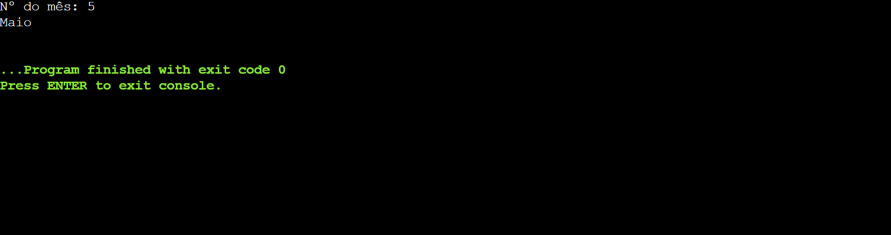

### Resolução em C

#### Código

```c
#include <stdio.h>

int main() {
    
    int n;
    printf ("Nº do mês (de 1 a 12) = ");
    scanf ("%d", &n);
    switch (n) {
        case 1:
            printf ("Janeiro\n");
            break;
        case 2:
            printf ("Fevereiro\n");
            break;
        case 3:
            printf ("Março\n");
            break;
        case 4:
            printf ("Abril\n");
            break;
        case 5:
            printf ("Maio\n");
            break;
        case 6:
            printf ("Junho\n");
            break;
        case 7:
            printf ("Julho\n");
            break;
        case 8:
            printf ("Agosto\n");
            break;
        case 9:
            printf ("Setembro\n");
            break;
        case 10:
            printf ("Outubro\n");
            break;
        case 11:
            printf ("Novembro\n");
            break;
        case 12:
            printf ("Dezembro\n");
            break;
        default:
            printf ("Mês inválido :(");
    }
    
    return 0;
}
```

#### Output


## Exercício 7

### Enunciado

Entrar um código de acesso a um curso. Se o código for 1, 2,3,4 e 5 exibir na tela 
Engenharia, Edificações, Sistemas Elétricos, Turismo e Análise de Sistemas 
respectivamente; caso contrário exibir que o código é inválido.

### Resolução em Python

#### Código

```py
match (int(input("Entre com o código do curso: "))):
    case 1:
        print ("Engenharia")
    case 2:
        print ("Edificações")
    case 3:
        print ("Sistemas Elétricos")
    case 4:
        print ("Turismo")
    case 5:
        print ("Análise de Sistemas")
    case _:
        print ("Código inválido")
```

#### Output

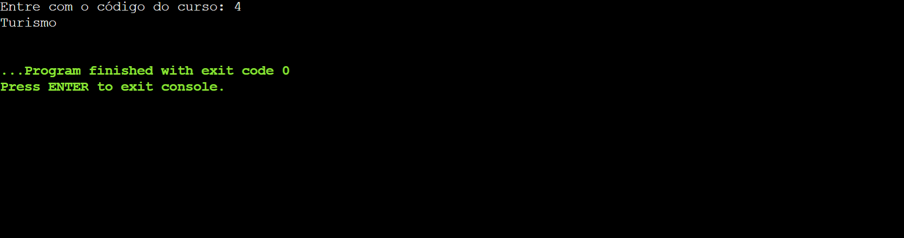

### Resolução em C

#### Código

```c
#include <stdio.h>

int main() {

    int n;
    printf ("Nº do curso = ");
    scanf ("%d", &n);
    switch (n) {
        case 1:
            printf ("Engenharia\n");
            break;
        case 2:
            printf ("Edificações\n");
            break;
        case 3:
            printf ("Sistemas Elétricos\n");
            break;
        case 4:
            printf ("Turismo\n");
            break;
        case 5:
            printf ("Análise de Sistemas\n");
            break;
    }

    return 0;
}
```

#### Output


# <center> Sala </center>

## Exercício 1

### Enunciado

Ler 3 valores referentes a 3 notas de um aluno e exibir uma mensagem dizendo que 
ele foi aprovado, se o valor da média for maior ou igual a 6.0. Se o aluno não foi 
aprovado, exibir mensagem informando essa condição. Exibir junto com uma das 
mensagens, o valor da média para qualquer condição.

### Resolução em Python

#### Código

```py
notas = [float(input("Entre com as notas:\nN1 = ")), float(input("N2 = ")), float(input("N3 = "))]
print ("\nAprovado :)") if (sum(notas) / 3 >= 6) else print ("\nReprovado :(")
print ("Média = %.2f" % (sum(notas) / 3))
```

#### Output

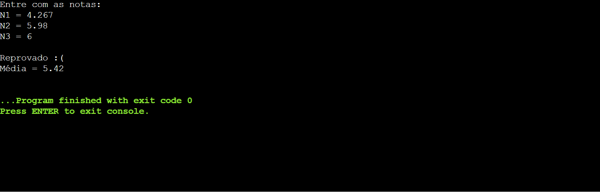

### Resolução em C

#### Código

```c
#include <stdio.h>

int main() {

    float notas[3];
    printf ("Entre com as notas:\n");
    for (int i = 1; i <= 3; i++) {
        printf ("N%d: ", i);
        scanf ("%f", &notas[i - 1]);
    }
    printf ("Média = %.2f\n", (notas[0] + notas[1] + notas[2]) / 3);
    if ((notas[0] + notas[1] + notas[2]) / 3 >= 6) {
        printf ("Aluno aprovado :)\n");
    }
    else {
        printf ("Aluno reprovado :(\n");
    }

    return 0;
}
```

#### Output

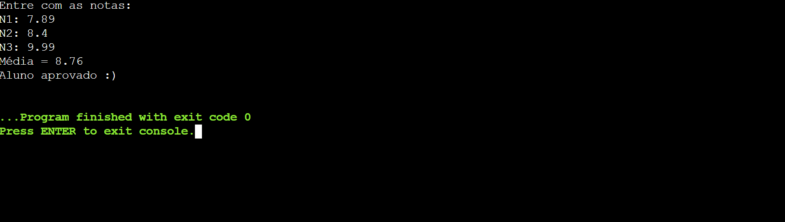

## Exercício 2

### Enunciado

Ler 2 valores referentes a 2 notas de um aluno e exibir uma mensagem dizendo que 
o aluno foi aprovado, se o valor da média for maior ou igual a 6.0. Se o valor da média 
for menor que 6.0, solicitar a nota de exame, somar com o valor da média e obtiver 
uma nova média. Se a nova média for maior ou igual a 5, exibir mensagem dizendo 
que o aluno foi aprovado em exame. Se o aluno não foi aprovado, exibir uma 
mensagem informando essa condição. Exibir junto com uma das mensagens, o valor 
da média para qualquer condição.

### Resolução em Python

#### Código

```py
n1 = float(input("Entre com as notas:\nN1 = "))
n2 = float(input("N2 = "))
if (n1 + n2) / 2 >= 6:
    print ("Aprovado :)\nMédia = %.2f" % ((n1 + n2) / 2))
else:
    e = float(input(("Eh rapaz, passa aí a nota do exame: ")))
    print ("Aprovado :)") if (n1 + n2 + e) / 3 >= 5 else print ("Reprovado :(") 
    print ("Média = %.2f" % ((n1 + n2 + e) / 3))
```

#### Output

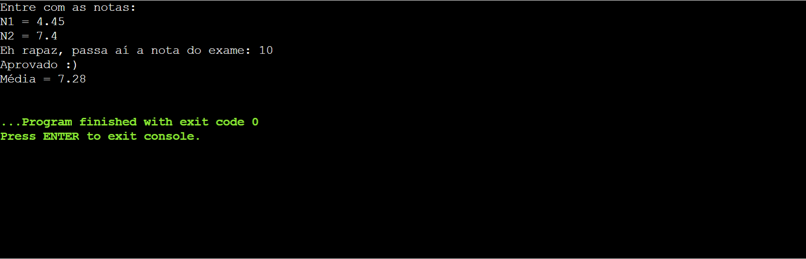


### Resolução em C

#### Código

```c
#include <stdio.h>

int main() {

    float n1, n2, e;
    printf ("Entre com as notas, vossa senhoria:\n");
    printf ("N1 = ");
    scanf ("%f", &n1);
    printf ("N2 = ");
    scanf ("%f", &n2);
    printf ("Média = %.2f\n", (n1 + n2) / 2);
    if ((n1 + n2) / 2 >= 6) {
        printf ("Aluno aprovado :)\n");
    }
    else {
        printf ("Infelizmente, precisaremos da nota de exame:\n");
        printf ("E = ");
        scanf ("%f", &e);
        printf ("Nova média = %.2f\n", (n1 + n2 + e) / 3);
        if ((n1 + n2 + e) / 3 >= 6) {
            printf ("Aluno aprovado em exame :)\n");
        }
        else {
            printf ("Aluno reprovado :(\n");
        }
    }

    return 0;
}
```

#### Output

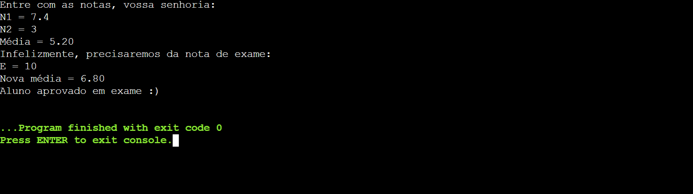

## Exercício 3

### Enunciado

Ler dois valores numéricos e exibir a diferença do maior para o menor.

### Resolução em Python

#### Código

```py
a = int(input("Entre com dois Nºs inteiros, irei dizer a diferença do maior para o menor:\nN1 = "))
b = int(input("N2 = "))
if a > b:
    print ("Diferença = ", a - b)
else:
    print ("Diferença = ", b - a)
```

#### Output

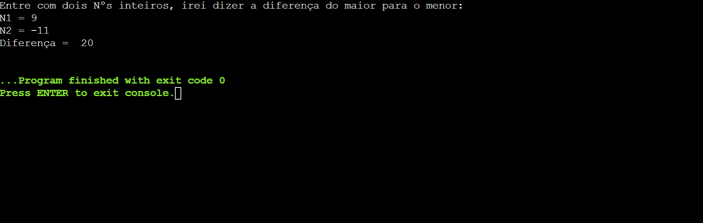

### Resolução em C

#### Código

```c
#include <stdio.h>

int main() {

    double a, b;
    printf ("A = ");
    scanf ("%lf", &a);
    printf ("B = ");
    scanf ("%lf", &b);
    if (a > b) {
        printf ("%.2lf - %.2lf = %.2lf\n", a, b, a - b);
    }
    else {
        printf ("%.2lf - %.2lf = %.2lf\n", b, a, b - a);
    }

    return 0;
}
```

#### Output

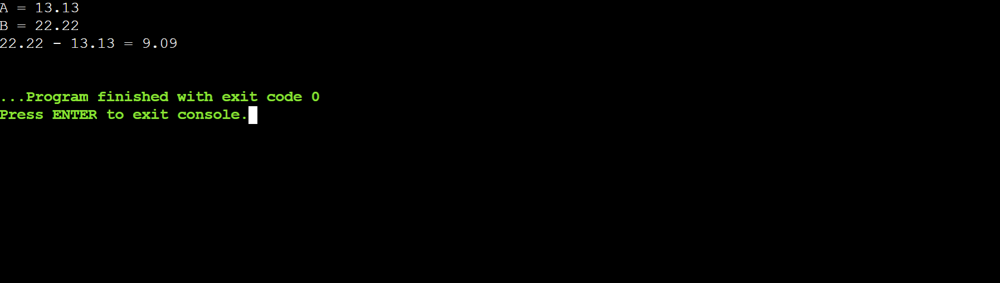

## Exercício 4

### Enunciado

Ler três valores para os lados de um triangulo, considerando lados como: A, B e C. 
Verificar se os lados fornecidos formam realmente um triangulo, e se essa condição for 
verdadeira, indicar qual o tipo do triangulo formado: isósceles, escaleno ou equilátero.
Triangulo é uma forma geométrica (polígono) composta de 3 lados, onde cada lado é 
menor que a soma dos dois outros lados. 
REGRA BÁSICA: Será um triangulo quando A < B + C, quando B < A + C e quando C < A + B.
Um triangulo é isósceles quando possui 2 lados iguais e um diferente, sendo A == B ou 
A == C ou B == C; é escaleno quando possui todos os lados diferentes, sendo A <> B e 
B <> C e é equilátero quando possui todos os lados iguais, sendo A == B e B == C.
Ler 3 valores para os lados de um triangulo: A, B e C.
Verificar se cada lado é menor que a soma dos dois outros lados. Se sim, saber se A = B 
e se B = C, sendo verdade exibir, o triangulo é equilátero, se não verificar A = B ou se 
A = C ou se B = C, sendo verdade exibir o triangulo é isósceles, caso contrário, o 
triangulo é escaleno.
Caso os lados não se caracterizem um triangulo, exibir mensagem informando a 
ocorrência.

### Resolução em Python

#### Código

```py
a = float(input("Entre com valores referentes aos lados de um triângulo, eu direi:\n\na) Se os lados formam, de fato, um triângulo\n\nEm caso afirmativo, direi se o triângulo é:\n\nb) Equilátero\nc) Isósceles\nd) Escaleno\n\nL1 = "))
b = float(input("L2 = "))
c = float(input("L3 = "))
if a < b + c and b < a + c and c < a + b:
    if a == b and b == c:
        print ("O triângulo é equilátero :)")
    elif a == b or a == c or b == c:
        print ("O triângulo é isósceles :)")
    else:
        print ("O triângulo é escaleno ;)")
else:
    print ("Os valores fornecidos não formam um triângulo :/")
```

#### Output

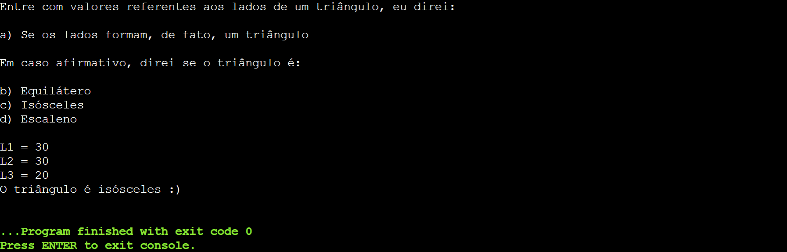


### Resolução em C

#### Código

```c
#include <stdio.h>

int main() {

    double a, b, c;
    printf ("Entre com os lados do triangulo, vossa senhoria:\n");
    printf ("A = ");
    scanf ("%lf", &a);
    printf ("B = ");
    scanf ("%lf", &b);
    printf ("C = ");
    scanf ("%lf", &c);
    if (a < b + c && b < a + c && c < b + a) {
        if (a == b && b == c) {
            printf ("Os valores dados formam um triangulo equilátero\n");
        }
        else if (a == b || a == c || b == c) {
            printf ("Os valores dados formam um triangulo isósceles\n");
        }
        else {
            printf ("Os valores dados formam um triangulo escaleno\n");
        }
    }
    else {
        printf ("Os valores dados não formarm um triangulo :(\n");
    }

    return 0;
}
```

#### Output

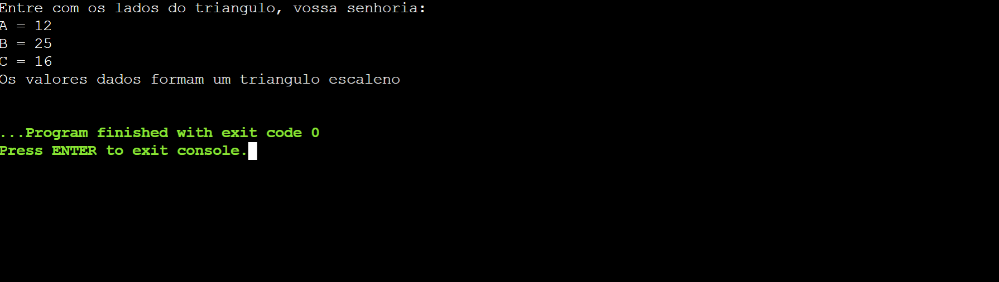

## Exercício 5

### Enunciado

Ler 3 valores (A, B e C) e exibir os valores dispostos em ordem crescente.

### Resolução em Python

#### Código

```py
val = input("Entre com valores inteiros, eu irei dispô-los em ordem crescente:\nNºs: ").split()
val = [int(i) for i in val]
val.sort()
print ("Conjunto ordenado:", val)
```

#### Output

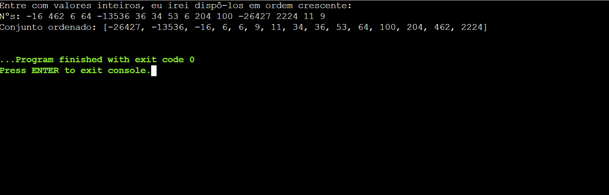

### Resolução em C

#### Código

```c
#include <stdio.h>

int main() {

    double a, b, c;
    printf ("Entre com os valores, irei ordená-los em ordem crescente:\n");
    printf ("A = ");
    scanf ("%lf", &a);
    printf ("B = ");
    scanf ("%lf", &b);
    printf ("C = ");
    scanf ("%lf", &c);
    if (a <= b && b <= c && a <= c) {
        printf ("%.2lf, %.2lf, %.2lf", a, b, c);
    }
    else if (a <= c && c <= b && a <= b) {
        printf ("%.2lf, %.2lf, %.2lf", a, c, b);
    }
    else if (b <= a && a <= c && b <= c) {
        printf ("%.2lf, %.2lf, %.2lf", b, a, c);
    }
    else if (b <= c && c <= a && b <= a) {
        printf ("%.2lf, %.2lf, %.2lf", b, c, a);
    }
    else if (c <= a && a <= b && c <= b) {
        printf ("%.2lf, %.2lf, %.2lf", c, a, b);
    }
    else {
        printf ("%.2lf, %.2lf, %.2lf", c, b, a);
    }

    return 0;
}
```

#### Output

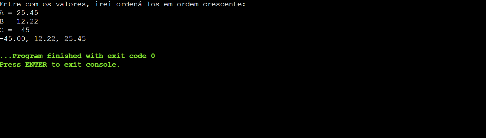

## Exercício 6

### Enunciado

Ler 3 valores (A, B e C) e calcular a equação de segundo grau, exibindo as duas 
raízes, se para os valores informados for possível efetuar o referido cálculo.

### Resolução em Python

#### Código

```py
a = float(input("Entre com os valores dos coeficientes da equação quadrática. Eu direi a solução se a equação houver solução:\nA = "))
b = float(input("B = "))
c = float(input("C = "))
if b ** 2 - 4 * a * c >= 0:
    print ("X' = %.2f" % (- b + ((b ** - 4 * a * c) ** 0.5) / (2 * a)))
    print ('X" = %.2f' % (- b - ((b ** - 4 * a * c) ** 0.5) / (2 * a)))
else:
    print ("A equação não possui solução :/")
```

#### Output

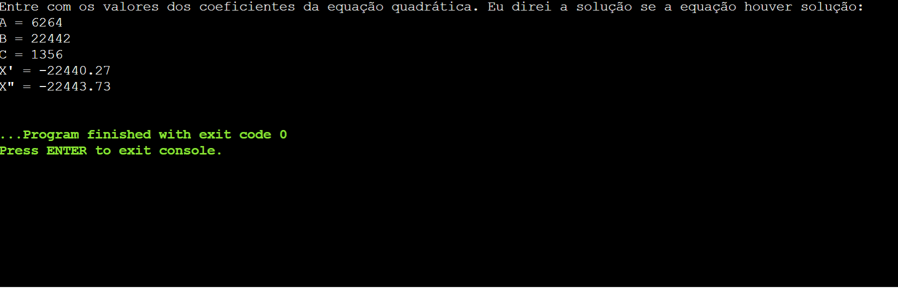

### Resolução em C

#### Código

```c
#include <stdio.h>
#include <math.h>

int main() {

    double a, b, c;
    printf ("Entre com os valores dos coeficientes, vossa senhoria:\n");
    printf ("A = ");
    scanf ("%lf", &a);
    printf ("B = ");
    scanf ("%lf", &b);
    printf ("C = ");
    scanf ("%lf", &c);
    if (pow(b, 2) - 4 * a * c >= 0) {
        printf ("X' = %.2lf\n", (- b + pow(pow(b, 2) - 4 * a * c, 0.5)) / (2 * a));
        printf ("X'' = %.2lf\n", (- b - pow(pow(b, 2) - 4 * a * c, 0.5)) / (2 * a));
    }
    else {
        printf ("A equação não possui solução :(\n");
    }

    return 0;
}
```

#### Output

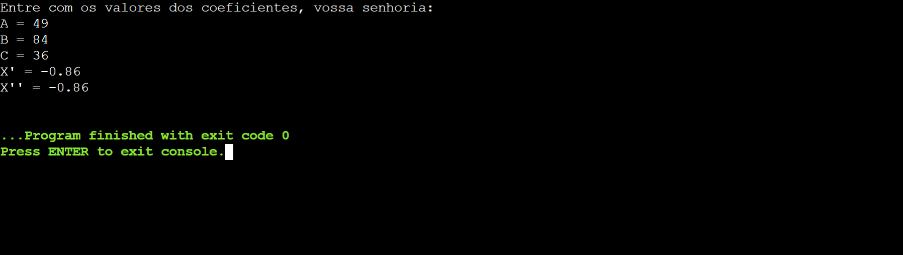

## Exercício 7

### Enunciado

Ler um valor inteiro positivo ou negativo e exibir o número lido como sendo um valor 
positivo, ou seja, o programa devera exibir o modulo de um número fornecido. Lembre-se de verificar se o número fornecido é menor que zero; sendo, multiplique-o por -1.

### Resolução em Python

#### Código

```py
n = int(input("Entre com um número inteiro. Eu direi qual é o módulo do mesmo:\nN = "))
print ("|%d| = " % (n), n) if n > 0 else print ("|%d| = " % (n), n * -1)
```

#### Output

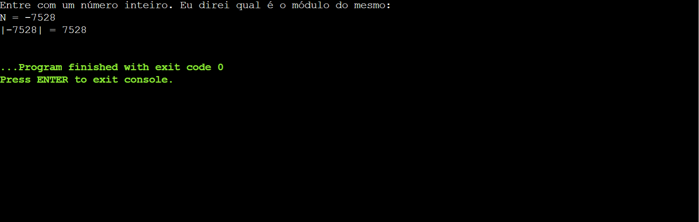


### Resolução em C

#### Código

```c
#include <stdio.h>

int main() {

    long x;
    printf ("Entre com um número, que eu mostrarei o módulo do mesmo\nN = ");
    scanf ("%ld", &x);
    if (x < 0) {
        printf ("|%ld| = %ld", x, x * -1);
    }
    else {
        printf ("|%ld| = %ld", x, x);
    }

    return 0;
}
```

#### Output

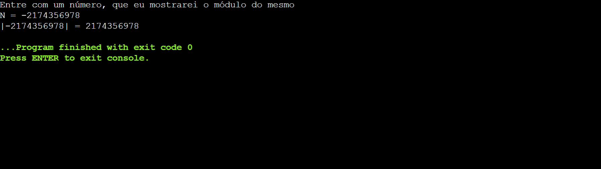

## Exercício 8

### Enunciado

Ler 3 números inteiros e exibir os números que são divisíveis por 2 e 3.

### Resolução em Python

#### Código

```py
nums = input("Entre com os números, eu direi se há divisibilidade por 2 e 3: ").split()
for i in nums:
    if int(i) % 6 == 0:
        print (i,"",end='')
print ("atende(m) os critérios de divisibilidade por 2 e 3")
```

#### Output

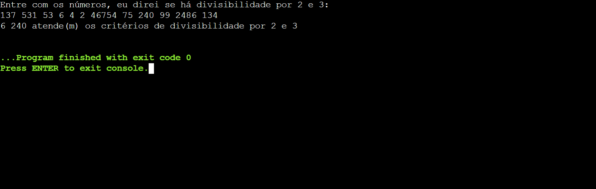

### Resolução em C

#### Código

```c
#include <stdio.h>

int main() {
    
    int nums[3];
    printf ("Entre com 3 números inteiros, direi se há divisibilidade por 2 e 3:\n");
    for (int i = 0; i <= 2; i++) {
        printf ("N%d = ", i + 1);
        scanf ("%d", &nums[i]);
        if (nums[i] % 6 == 0) {
            printf ("%d é divisível por 2 e 3 :)\n", nums[i]);
        }
    }
    
    return 0;
}
```

#### Output

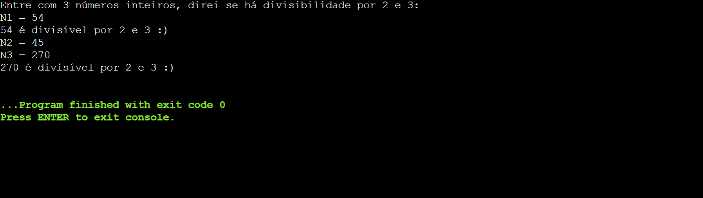

## Exercício 9

### Enunciado

Ler 2 números inteiros e exibir os números que são divisíveis por 4 ou 5.

### Resolução em Python

#### Código

```py
nums = input("Entre com números, direi se há divisibilidade por 4 ou 5:\n").split()
for i in nums:
    if int(i) % 4 == 0 or int(i) % 5 == 0:
        print (i,"",end='')
print ("atende(m) os critérios de divisibilidade ou por 4 ou por 5")
```

#### Output

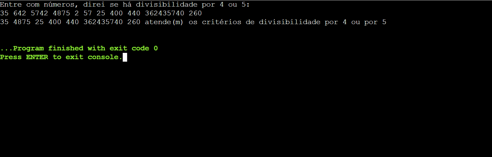

### Resolução em C

#### Código

```c
#include <stdio.h>

int main() {
    
    int a, b;
    printf ("Entre com 2 números, dir-te-ei se há divisibilidade por 4 ou 5:\n");
    printf ("N1 = ");
    scanf ("%d", &a);
    printf ("N2 = ");
    scanf ("%d", &b);
    if (a % 4 == 0 || a % 5 == 0) {
        printf ("%d é divisível por 4 ou 5\n", a);
    }
    if (b % 4 == 0 || b % 5 == 0) {
        printf ("%d é divisível por 4 ou 5\n", b);
    }
    
    return 0;
}
```

#### Output

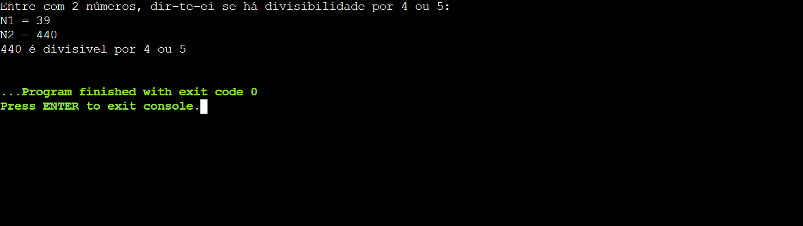

## Exercício 10

### Enunciado

Faça um algoritmo que receba como entrada o mês (de 1 a 12) e retorne o nome 
do respectivo mês. (Utilizar caso/seja)

### Resolução em Python

#### Código

```py
match (int(input("Nº do mês: "))):
    case 1:
        print ("Janeiro")
    case 2:
        print ("Fevereiro")
    case 3:
        print ("Março")
    case 4:
        print ("Abril")
    case 5:
        print ("Maio")
    case 6:
        print ("Junho")
    case 7:
        print ("Julho")
    case 8:
        print ("Agosto")
    case 9:
        print ("Setembro")
    case 10:
        print ("Outubro")
    case 11:
        print ("Novembro")
    case 12:
        print ("Dezembro")
    case _:
        print ("Mês inválido :/")
```

#### Output

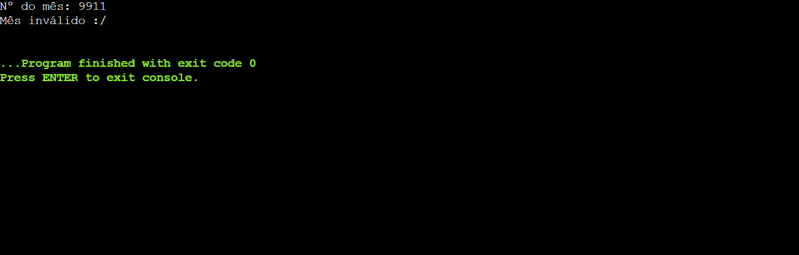

### Resolução em C

#### Código

```c
#include <stdio.h>

int main() {
    
    int mes;
    printf ("Nº do mês (de 1 a 12): ");
    scanf ("%d", &mes);
    switch (mes) {
        case 1:
            printf ("Janeiro\n");
            break;
        case 2:
            printf ("Fevereiro\n");
            break;
        case 3:
            printf ("Março\n");
            break;
        case 4:
            printf ("Abril\n");
            break;
        case 5:
            printf ("Maio\n");
            break;
        case 6:
            printf ("Junho\n");
            break;
        case 7:
            printf ("Julho\n");
            break;
        case 8:
            printf ("Agosto\n");
            break;
        case 9:
            printf ("Setembro\n");
            break;
        case 10:
            printf ("Outubro\n");
            break;
        case 11:
            printf ("Novembro\n");
            break;
        case 12:
            printf ("Dezembro\n");
            break;
        default:
            printf ("Mês inválido :(");
    }
    
    return 0;
}
```

#### Output

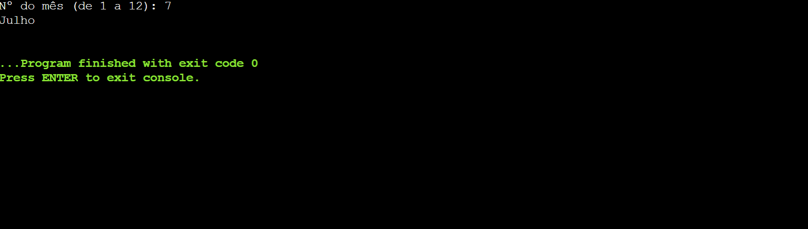

E aqui encerra-se a jornada da lista 2.

# Agradecimentos

Se você chegou até aqui, obrigado pela paciência em analisar e avaliar meus códigos.

Caso tenha alguma sugestão de pauta, não hesite em me contatar e expor o seu ponto.

Até a próxima lista.

Continue aprendendo.

Abraços,

Raphael Vicente.