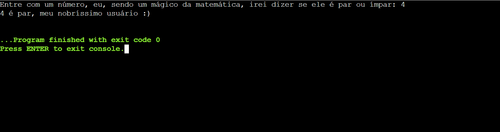
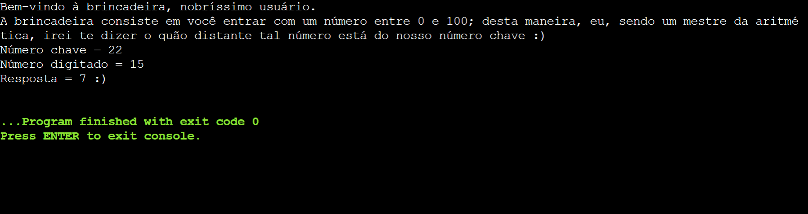
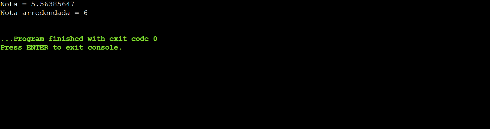
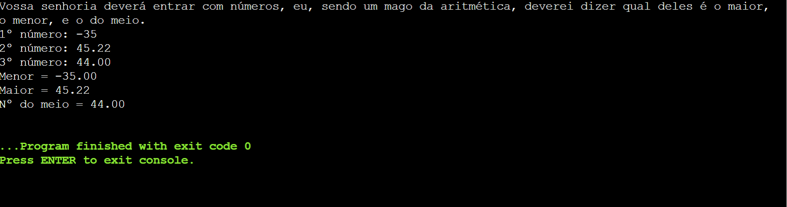
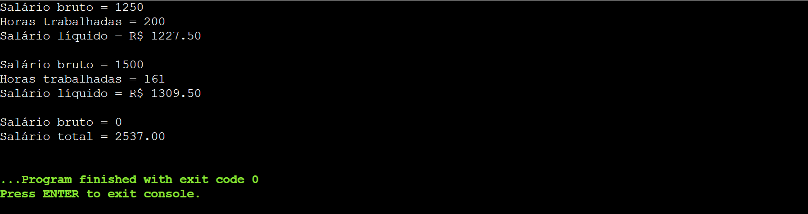
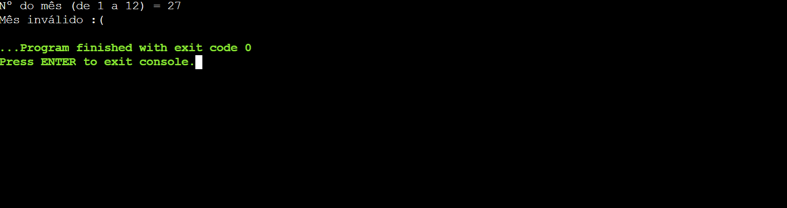
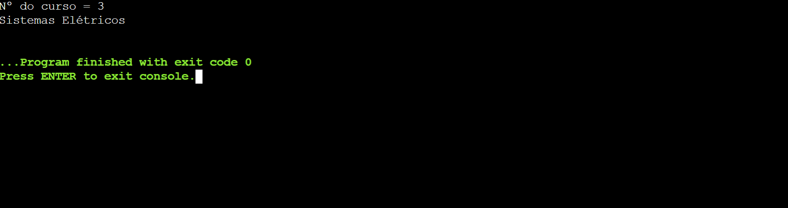

# Lista 2

# Índice

# <center> Índice </center>
- <a href="#casa">Casa</a>
    - <a href="#exercício-1">Exercício 1</a>
    - <a href="#exercício-2">Exercício 2</a>
    - <a href="#exercício-3">Exercício 3</a>
    - <a href="#exercício-4">Exercício 4</a>
    - <a href="#exercício-5">Exercício 5</a>
    - <a href="#exercício-6">Exercício 6</a>
    - <a href="#exercício-7">Exercício 7</a>
- <a href="#sala">Sala</a>
    - <a href="#exercício-1-1">Exercício 1</a>
    - <a href="#exercício-1-2">Exercício 2</a>
    - <a href="#exercício-1-3">Exercício 3</a>
    - <a href="#exercício-1-4">Exercício 4</a>
    - <a href="#exercício-1-5">Exercício 5</a>
    - <a href="#exercício-1-6">Exercício 6</a>
    - <a href="#exercício-1-7">Exercício 7</a>
    - <a href="#exercício-1-8">Exercício 8</a>
    - <a href="#exercício-1-9">Exercício 9</a>
    - <a href="#exercício-1-10">Exercício 10</a>
    - <a href="#exercício-1-11">Exercício 11</a>
    - <a href="#exercício-1-12">Exercício 12</a>
    - <a href="#exercício-1-13">Exercício 13</a>

# Casa

## Exercício 1

### Enunciado

Elaborar um programa em que informe se o número digitado pelo usuário é par ou 
impar.

### Reslução em Python

```py
```

#### Código



#### Output

### Reslução em C

#### Código

```c
```

#### Output


## Exercício 2

### Enunciado

Digitado um número inteiro entre 0 e 100, informar o quanto ele está distante de um 
determinado número chave, carregado no próprio programa. Ex.: Número chave=20, 
número digitado=15, resposta=5. Número chave=17, número digitado=20, resposta=3 
(Obs.: a resposta deverá ser sempre um número positivo).

### Reslução em Python

```py
```

#### Código



#### Output

### Reslução em C

#### Código

```c
```

#### Output


## Exercício 3

### Enunciado

Uma Universidade tem problemas com arredondamento das médias dos alunos, 
pois cada professor estipula um critério de arredondamento. Devemos elaborar um 
programa, em Linguagem C++, para a secretaria da Universidade, resolvendo esse 
problema. O programa deve solicitar uma nota e fazer o devido arredondamento.
Regras:
Notas que ultrapassem 0,5 de resto serão arredondas para CIMA.
Ex: 4,6 –>5,0
Notas que abaixo ou igual a 0,5 de resto serão arredondas para BAIXO.
Ex: 4,5 –> 4,0

### Reslução em Python

```py
```

#### Código



#### Output

### Reslução em C

#### Código

```c
```

#### Output


## Exercício 4

### Enunciado

Faça um programa que leia 3 números e exiba:
a) O maior número;
b) O menor número;
c) O número do meio.

### Reslução em Python

```py
```

#### Código



#### Output

### Reslução em C

#### Código

```c
```

#### Output


## Exercício 5

### Enunciado

Faça o programa que calcule o salário líquido dos funcionários de uma empresa. O 
salário líquido é composto por descontos e adicionais, seguindo as seguintes regras:
<b>Descontos</b>:

- Salário bruto < 800,00 – não realizar nenhum desconto;
800,00 <= Salário bruto <=1600,00 – descontar 8% de Imposto de Renda e 5
% de encargos.
- >1600,00 – descontar 15% de Imposto de Renda e 7% de encargos.

<b>Adicionais</b>:
Caso o funcionário tenha trabalhado mais de 160 horas no mês, divida o seu salário 
bruto por 160 (representa horas trabalhadas) e calcule 50% de adicional nas horas 
que excederam a 160.
O usuário deverá digitar o salário bruto e o número de horas trabalhadas no mês de 
cada funcionário, e deverá receber como resultado o salário líquido. O usuário poderá 
calcular salário para N funcionários, para finalizar o programa o usuário deverá digitar 
0 no salário bruto, ao finalizar o programa exibir o total geral dos salários líquidos.

### Reslução em Python

```py
```

#### Código



#### Output

### Reslução em C

#### Código

```c
```

#### Output


## Exercício 6

### Enunciado

Faça um programa que receba como entrada o mês (de 1 a 12) e retorne o nome 
do respectivo mês. 

### Reslução em Python

```py
```

#### Código



#### Output

### Reslução em C

#### Código

```c
```

#### Output


## Exercício 7

### Enunciado

Entrar um código de acesso a um curso. Se o código for 1, 2,3,4 e 5 exibir na tela 
Engenharia, Edificações, Sistemas Elétricos, Turismo e Análise de Sistemas 
respectivamente; caso contrário exibir que o código é inválido.

### Reslução em Python

```py
```

#### Código



#### Output

### Reslução em C

#### Código

```c
```

#### Output

