# Lista 3 - Casa e Sala


Bem vindo(a) à Lista 3 resolvida em Python e em C.

As novidades desta lista incluem:

- Uso de laços de repetição:
    - while
    - for
    - do/while (c)

Esta lista veio como uma bomba para a turma toda. Lembro-me de, após ter ficado 1243546756876 horas fritando os neurônios a fim de resolver o exercício da sequência de Fibonacci e não ter conseguido, ter assistido a uma videoaula no YouTube que explodiu minha cabeça.

Você irá perceber que, após eu ter evoluído drasticamente na programação (durante o período que minha escola esteve de greve), eu resolvi personalizar os exercícios ao refazê-los e acabei me deparando com umas fórmulas malucas...

# Sumário
- <a href="#casa">Casa</a>
    - <a href="#exercício-1">Exercício 1</a>
    - <a href="#exercício-2">Exercício 2</a>
    - <a href="#exercício-3">Exercício 3</a>
    - <a href="#exercício-4">Exercício 4</a>
    - <a href="#exercício-5">Exercício 5</a>
    - <a href="#exercício-6">Exercício 6</a>
    - <a href="#exercício-7">Exercício 7</a>
    - <a href="#exercício-8">Exercício 8</a>
    - <a href="#exercício-9">Exercício 9</a>
    - <a href="#exercício-10">Exercício 10</a>
    - <a href="#exercício-11">Exercício 11</a>
- <a href="#sala">Sala</a>
    - <a href="#exercício-1-1">Exercício 1</a>
    - <a href="#exercício-2-1">Exercício 2</a>
    - <a href="#exercício-3-1">Exercício 3</a>
    - <a href="#exercício-4-1">Exercício 4</a>
    - <a href="#exercício-5-1">Exercício 5</a>
    - <a href="#exercício-6-1">Exercício 6</a>
    - <a href="#exercício-7-1">Exercício 7</a>
    - <a href="#exercício-8-1">Exercício 8</a>
    - <a href="#exercício-9-1">Exercício 9</a>
    - <a href="#exercício-10-1">Exercício 10</a>
    - <a href="#exercício-11-1">Exercício 11</a>

# Casa

## Exercício 1

### Enunciado

Elaborar um programa que escreva em tela os números de 1 a 20, utilizando o 
comando while( ).

### Resolução em Python

#### Código

```py
while True:
    while True:
        try:
            vals = input("Na mesma linha, entre com os valores, respectivamente, referentes a:\n\n1) 1º termo da sequência (a1)\n2) Último termo da sequência (an)\n3) Razão da sequência (r)\nPara sair, entre com 0 em todos os valores\n\n").split()
            vals[0], vals[1], vals[2] = int(vals[0]), int(vals[1]), int(vals[2])
            break
        except:
            print ("*Número(s) inválido(s)... Tente novamente*")
    if vals[0] == vals[1] == vals[2] == 0:
        break
    print (f"Aqui esão os números de {vals[0]} até {vals[1]}, de {vals[2]} em {vals[2]}:")
    if vals[0] <= vals[1]:
        while vals[0] <= vals[1]:
            print (f"{vals[0]} ", end="")
            vals[0] += vals[2]
    else:
        while vals[0] >= vals[1]:
            print (f"{vals[0]} ", end="")
            vals[0] -= vals[2]
    print ("\n")
print ("\nAdeus!")
```
#### Output

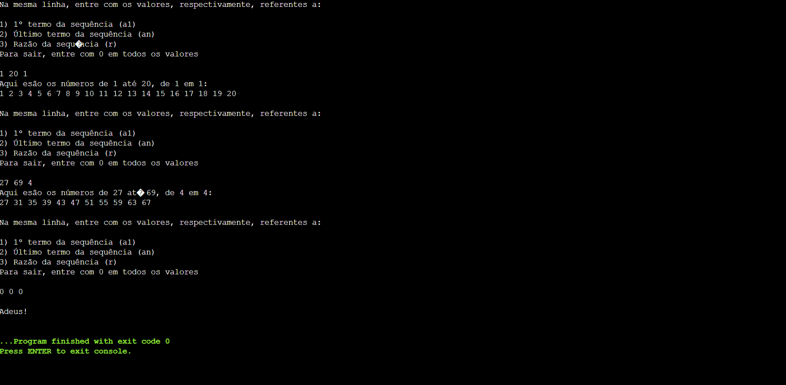

### Resolução em C

#### Código

```c
#include <stdio.h>
#include <string.h>
#include <stdlib.h>

int main() {
    
    for (;;) {
        char *dados = (char*)malloc(10 * sizeof (char));
        int vals[3] = {0, 0, 0};
        for (;;) {
            printf ("Na mesma linha, entre com os valores inteiros, respectivamente, referentes a:\n\n1) 1º Número da sequência (a1)\n2) Último número da sequência (an)\n3) Razão da sequência (r)\nPara sair, entre com 0 em todos os valores\n\n");
            fgets (dados, 10, stdin);
            char *pt = strtok(dados, " ");
            int i = 0;
            while (pt != NULL) {
                vals[i] = atoi(pt);
                pt = strtok(NULL, " ");
                ++i;
            }
            if (vals[0] == 0 && vals[1] == 0 && vals[2] == 0) {
                break;
            }
            else if (vals[2] == 0) {
                printf ("*Número(s) inválido(s)... Tente novamente*");
            }
            else {
                break;
            }
        }
        if (vals[0] == 0 && vals[1] == 0 && vals[2] == 0) {
            break;
        }
        printf ("Aqui estão os números de %d até %d, de %d em %d:\n", vals[0], vals[1], vals[2], vals[2]);
        if (vals[0] <= vals[1]) {
            while (vals[0] <= vals[1]) {
                printf ("%d ", vals[0]);
                vals[0] += vals[2];
            }
        }
        else {
            while (vals[0] >= vals[1]) {
                printf ("%d ", vals[0]);
                vals[0] -= vals[2];
            }
        }
        printf ("\n");
    }
    printf ("\nAdeus!");
    return 0;
}
```
#### Output

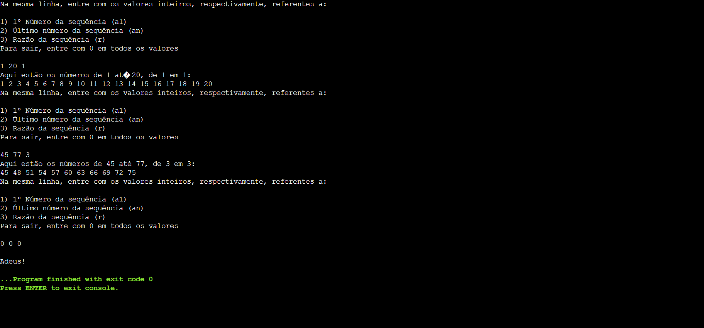

## Exercício 2

### Enunciado

Elaborar um programa que escreva em tela todos os números pares existentes 
entre 20 e 1, utilizando o comando while( ).

### Resolução em Python

#### Código

```py
while True:
    while True:
        try:
            vals = input("Na mesma linha, entre com os valores, respectivamente, referentes a:\n\n1) 1º termo da sequência (a1)\n2) Último termo da sequência (an)\n3) Paridade dos termos (0 para pares e 1 para ímpares)\nPara sair, entre com 0 em todos os valores\n\n").split()
            vals[0], vals[1], vals[2] = int(vals[0]), int(vals[1]), int(vals[2])
            if vals[2] != 1 and vals[2] != 0:
                print ("*Número(s) inválido(s)... Tente novamente*")
            else:
                break
        except:
            print ("*Número(s) inválido(s)... Tente novamente*")
    if vals[0] == vals[1] == vals[2] == 0:
        break
    if vals[2] == 0:
        print (f"Aqui estão os termos pares, entre {vals[0]} e {vals[1]}:")
    else:
        print (f"Aqui estão os termos ímpares, entre {vals[0]} e {vals[1]}:")
    if vals[0] <= vals[1]:
        if vals[0] % 2 != 0 and vals[2] == 0 or vals[0] % 2 == 0 and vals[2] == 1:
            vals[0] += 1
        if vals[1] % 2 != 0 and vals[2] == 0 or vals[1] % 2 == 0 and vals[2] == 1:
            vals[1] -= 1
        while vals[0] <= vals[1]:
            print (f"{vals[0]} ", end="")
            vals[0] += 2
    else:
        if vals[0] % 2 != 0 and vals[2] == 0 or vals[0] % 2 == 0 and vals[2] == 1:
            vals[0] -= 1
        if vals[1] % 2 != 0 and vals[2] == 0 or vals[1] % 2 == 0 and vals[2] == 1:
            vals[1] += 1
        while vals[0] >= vals[1]:
            print (f"{vals[0]} ", end="")
            vals[0] -= 2
    print ("\n")
print ("\nAdeus!")
```
#### Output

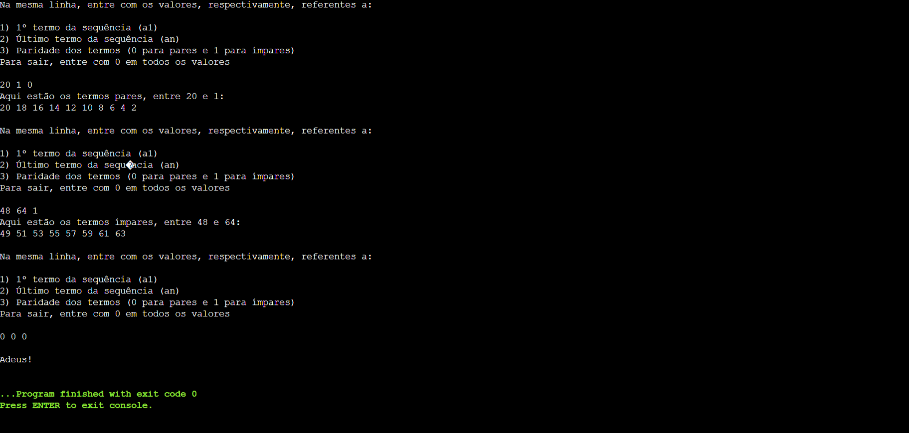

### Resolução em C

#### Código

```c
#include <stdio.h>
#include <stdlib.h>
#include <string.h>

int main() {
    
    for (;;) {
        char *dados = (char*)malloc(10 * sizeof(char));
        int vals[3] = {0, 0, 0};
        for (;;) {
            printf ("Na mesma linha, entre, respectivamente, com os valores inteiros referentes a:\n\n1) Primeiro Número (a1)\n2) Último número (an)\n3) Paridade dos termos (0 se forem pares e 1 se forem ímpares)\nPara sair, entre com 0 em todos os valores\n\n");
            fgets (dados, 10, stdin);
            char *pt = strtok(dados, " ");
            int i = 0;
            while (pt != NULL) {
                vals[i] = atoi(pt);
                ++i;
                pt = strtok(NULL, " ");
            }
            if (vals[2] != 0 && vals[2] != 1) {
                printf ("*Número(s) inválidos... Tente novamente\n*");
            }
            else {
                break;
            }
        }
        if (vals[0] == 0 && vals[1] == 0 && vals[2] == 0) {
            break;
        }
        if (vals[0] % 2 == 0 && vals[2] == 1 || vals[0] % 2 != 0 && vals[2] == 2) {
            if (vals[0] <= vals[1]) {
                vals[0] += 1;
            }
            else {
                vals[0] -= 1;
            }
        }
        if (vals[1] % 2 == 0 && vals[2] == 1 || vals[1] % 2 != 0 && vals[2] == 2) {
            if (vals[1] > vals[0]) {
                vals[1] -= 1;
            }
            else {
                vals[1] += 1;
            }
        }
        printf ("Aqui estão os termos x | x %% 2 = %d, entre %d e %d:\n", vals[2], vals[0], vals[1]);
        if (vals[0] <= vals[1]) {
            while (vals[0] <= vals[1]) {
                printf ("%d ", vals[0]);
                vals[0] += 2;
            }
        }
        else {
            while (vals[0] >= vals[1]) {
                printf ("%d ", vals[0]);
                vals[0] -= 2;
            }
        }
        printf ("\n");
    }
    printf ("\nAdeus!");
    return 0;
}
```
#### Output

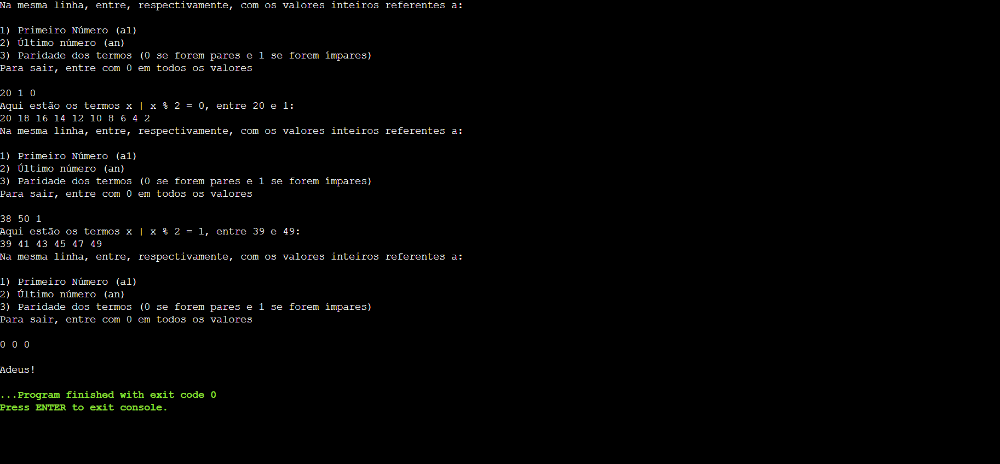

## Exercício 3

### Enunciado

Elaborar um programa que escreva em tela os números de 1 a 20, informando 
quando eles são pares e quando são ímpares, utilizando o comando while( ).

### Resolução em Python

#### Código

```py
while True:
    while True:
        try:
            vals = input("Na mesma linha, entre com os valores, respectivamente, referentes a:\n\n1) 1º termo da sequência (a1)\n2) Último termo da sequência (an)\n3) Razão da sequência (r)\nPara sair, entre com 0 em todos os valores\n\n").split()
            vals[0], vals[1], vals[2] = int(vals[0]), int(vals[1]), int(vals[2])
            break
        except:
            print ("*Número(s) inválido(s)... Tente novamente*")
    if vals[0] == vals[1] == vals[2] == 0:
        break
    if (vals[0] <= vals[1]):
        while (vals[0] <= vals[1]):
            print (f"{vals[0]} ", end="")
            if (vals[0] % 2 == 0):
                print ("é par")
            else:
                print ("é ímpar")
            vals[0] += vals[2]
    else:
        while (vals[0] >= vals[1]):
            print (f"{vals[0]} ", end="")
            if (vals[0] % 2 == 0):
                print ("é par")
            else:
                print ("é ímpar")
            vals[0] -= vals[2]
    print ()
print ("\nAdeus!")
```
#### Output

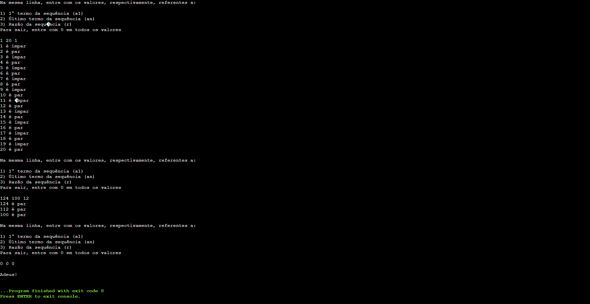

### Resolução em C

#### Código

```c
#include <stdio.h>
#include <stdlib.h>
#include <string.h>

int main() {
    for (;;) {
        char *dados = (char*)malloc(10 * sizeof (char));
        int vals[3] = {0, 0, 0};
        for (;;) {
            printf ("Na mesma linha, entre com os valores inteiros referentes a:\n\n1) 1º Número da sequência\n2) Último número da sequência (an)\n3) Razão da sequência (r)\nPara sair, entre com 0 em todos os valores\n\n");
            fgets(dados, 10, stdin);
            char *pt = strtok(dados, " ");
            int i = 0;
            while (pt != NULL) {
                vals[i] = atoi(pt);
                ++i;
                pt = strtok(NULL, " ");
            }
            if (vals[0] == 0 && vals[1] == 0 && vals[2] == 0) {
                break;
            }
            else if (vals[2] == 0) {
                printf ("*Número(s) inválidos... Tente novamente\n*");
            }
            else {
                break;
            }
        }
        if (vals[0] == 0 && vals[1] == 0 && vals[2] == 0) {
            break;
        }
        if (vals[0] <= vals[1]) {
            while (vals[0] <= vals[1]) {
                printf ("%d é ", vals[0]);
                if (vals[0] % 2 == 0) {
                    printf ("par\n");
                }
                else {
                    printf ("ímpar\n");
                }
                vals[0] += vals[2];
            }
        }
        else {
            while (vals[0] >= vals[1]) {
                printf ("%d é ", vals[0]);
                if (vals[0] % 2 == 0) {
                    printf ("par\n");
                }
                else {
                    printf ("ímpar\n");
                }
                vals[0] -= vals[2];
            }
        }
        printf ("\n");
    }
    printf ("\nAdeus!");
    return 0;
}
```
#### Output

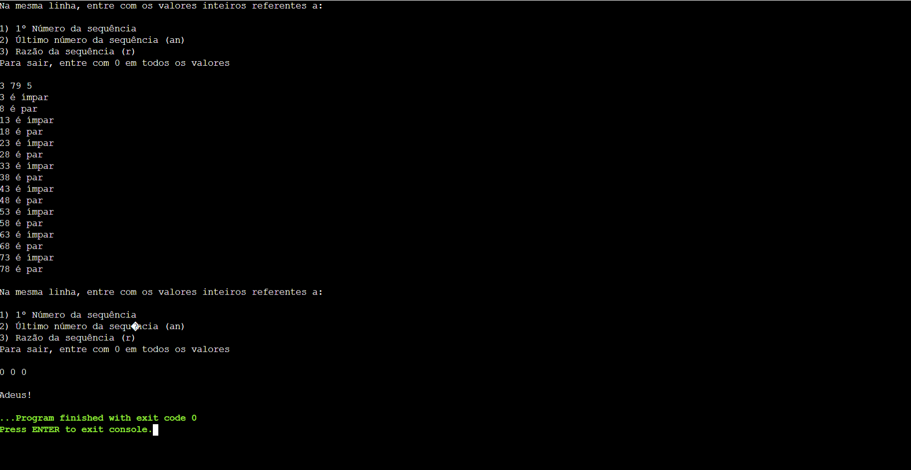

## Exercício 4

### Enunciado

Elaborar um programa que escreva em tela os números de 20 a 1, utilizando o 
comando for( ).

### Resolução em Python

#### Código

```py
while True:
    while True:
        try:
            vals = input("Na mesma linha, entre com os valores, respectivamente, referentes a:\n\n1) 1º termo da sequência (a1)\n2) Último termo da sequência (an)\n3) Razão da sequência (r)\nPara sair, entre com 0 em todos os valores\n\n").split()
            vals[0], vals[1], vals[2] = int(vals[0]), int(vals[1]), int(vals[2])
            break
        except:
            print ("*Número(s) inválido(s)... Tente novamente*")
    if vals[0] == vals[1] == vals[2] == 0:
        break
    print (f"Aqui estão os números de {vals[0]} até {vals[1]}, de {vals[2]} em {vals[2]}:")
    if (vals[0] <= vals[1]):
        for vals[0] in range (vals[0], vals[1] + 1, vals[2]):
            print (f"{vals[0]} ", end="")
    else:
        for vals[0] in range (vals[0], vals[1] - 1, -vals[2]):
            print (f"{vals[0]} ", end="")
    print ("\n")
print ("\nAdeus!")
```
#### Output

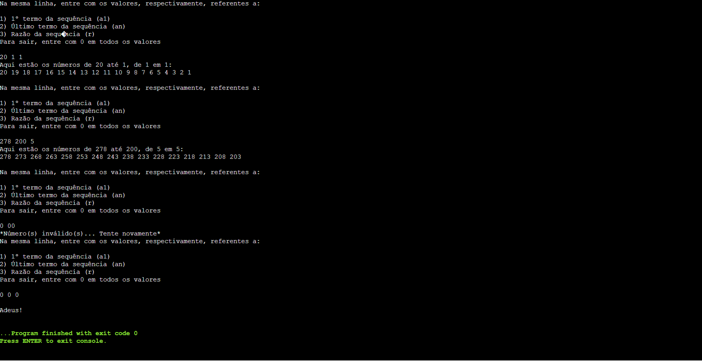

### Resolução em C

#### Código

```c
#include <stdio.h>
#include <stdlib.h>
#include <string.h>

int main() {
    
    for (;;) {
        char *dados = (char*)malloc(10 * sizeof (char));
        int vals[3] = {0, 0, 0};
        for (;;) {
            printf ("Na mesma linha, entre com os valores, respectivamente, referentes a:\n\n1) Primeiro número da sequência (a1)\n2) Último número da sequência (an)\n3) Razão da sequência (r)\nPara sair, entre com 0 em todos os valores\n\n");
            fgets(dados, 10, stdin);
            char *pt = strtok(dados, " ");
            int i = 0;
            while (pt != NULL) {
                vals[i] = atoi(pt);
                ++i;
                pt = strtok(NULL, " ");
            }
            if (vals[0] == 0 && vals[1] == 0 && vals[2] == 0) {
                break;
            }
            else if (vals[2] == 0) {
                printf ("*Número(s) inválido(s)...Tente novamente*\n");   
            }
            else {
                break;
            }
        }
        if (vals[0] == 0 && vals[1] == 0 && vals[2] == 0) {
            break;
        }
        printf ("Aqui está a sequência de números, de %d até %d, de %d em %d:\n", vals[0], vals[1], vals[2], vals[2]);
        if (vals[0] <= vals[1]) {
            for (vals[0]; vals[0] <= vals[1]; vals[0] += vals[2]) {
               printf ("%d ", vals[0]);
            }
        }
        else {
            for (vals[0]; vals[0] >= vals[1]; vals[0] -= vals[2]) {
               printf ("%d ", vals[0]);
            }
        }
        printf ("\n");
    }
    printf ("\nAdeus!");
    return 0;
}
```
#### Output

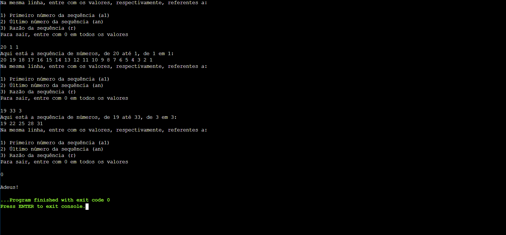

## Exercício 5

### Enunciado

Elaborar um programa que escreva em tela todos os números impares existentes 
entre 1 e 20, utilizando o comando for( ).

### Resolução em Python

#### Código

```py
while True:
    while True:
        try:
            vals = input("Na mesma linha, entre com os valores, respectivamente, referentes a:\n\n1) 1º termo da sequência (a1)\n2) Último termo da sequência (an)\n3) Paridade dos termos (0 para pares e 1 para ímpares)\nPara sair, entre com 0 em todos os valores\n\n").split()
            vals[0], vals[1], vals[2] = int(vals[0]), int(vals[1]), int(vals[2])
            if vals[2] != 0 and vals[2] != 1:
                print ("*Número(s) inválido(s)... Tente novamente*")    
            else:
                break
        except:
            print ("*Número(s) inválido(s)... Tente novamente*")
    if vals[0] == vals[1] == vals[2] == 0:
        break
    if vals[2] == 0:
        print (f"Aqui estão os termos pares, entre {vals[0]} e {vals[1]}:")
    else:
        print (f"Aqui estão os termos ímpares, entre {vals[0]} e {vals[1]}:")
    if vals[0] < vals[1]:
        if vals[0] % 2 != 0 and vals[2] == 0 or vals[0] % 2 == 0 and vals[2] == 1:
            vals[0] += 1
        if vals[1] % 2 != 0 and vals[2] == 0 or vals[1] % 2 == 0 and vals[2] == 1:
            vals[1] -= 1
        for vals[0] in range (vals[0], vals[1] + 1, 2):
            print (f"{vals[0]} ", end="")
    else:
        if vals[0] % 2 != 0 and vals[2] == 0 or vals[0] % 2 == 0 and vals[2] == 1:
            vals[0] -= 1
        if vals[1] % 2 != 0 and vals[2] == 0 or vals[1] % 2 == 0 and vals[2] == 1:
            vals[1] += 1
        for vals[0] in range (vals[0], vals[1] - 1, -2):
            print (f"{vals[0]} ", end="")
    print ("\n")
print ("\nAdeus!")
```
#### Output

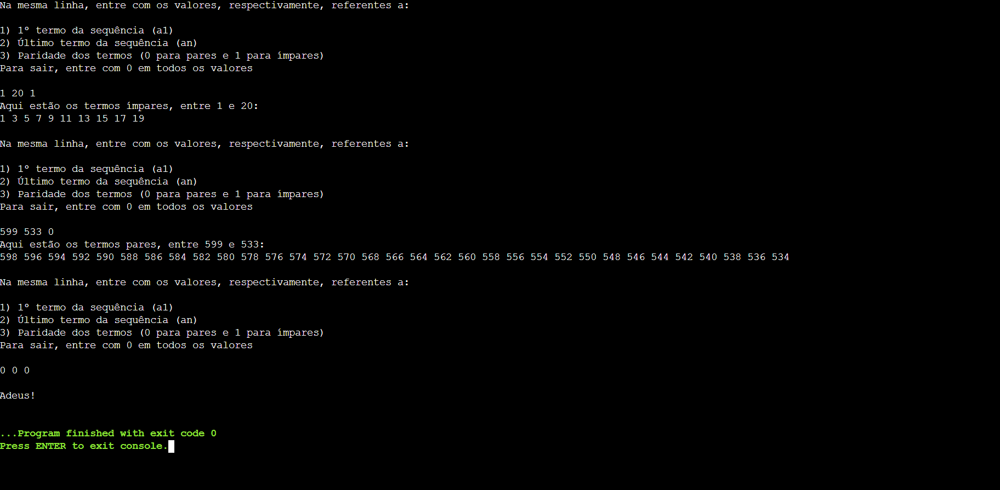

### Resolução em C

#### Código

```c
#include <stdio.h>
#include <stdlib.h>
#include <string.h>

int main() {
    for (;;) {
        char *dados = (char*)malloc(10 * sizeof (char));
        int vals[3] = {0, 0, 0};
        for (;;) {
            printf ("Na mesma linha, entre, respectivamente, com os valores referentes a:\n\n1) 1º Número da sequência (a1)\n2) Último número da sequência (an)\n3) Paridade dos termos da sequência (0 para pares e 1 para ímpares)\nPara sair, entre com 0 em todos os valores\n\n");
            fgets (dados, 10, stdin);
            char *pt = strtok(dados, " ");
            int i = 0;
            while (pt != NULL) {
                vals[i] = atoi(pt);
                pt = strtok(NULL, " ");
                ++i;
            }
            if (vals[2] != 0 && vals[2] != 1) {
                printf ("*Número(s) inválidos... Tente novamente*\n");
            }
            else {
                break;
            }
        }
        if (vals[0] == 0 && vals[1] == 0 && vals[2] == 0) {
            break;
        }
        if (vals[0] % 2 == 0 && vals[2] == 1 || vals[0] % 2 != 0 && vals[2] == 0) {
            if (vals[0] <= vals[1]) {
                vals[0] += 1;
            }
            else {
                vals[0] -= 1;
            }
        }
        if (vals[1] % 2 == 0 && vals[2] == 1 || vals[1] % 2 != 0 && vals[2] == 0) {
            if (vals[1] > vals[0]) {
                vals[1] -= 1;
            }
            else {
                vals[1] += 1;
            }
        }
        if (vals[0] <= vals[1]) {
            for (vals[0]; vals[0] <= vals[1]; vals[0] += 2) {
                printf ("%d ", vals[0]);
            }
        }
        else {
            for (vals[0]; vals[0] >= vals[1]; vals[0] -= 2) {
               printf ("%d ", vals[0]);
            }
        }
        printf ("\n");
    }
    printf ("\nAdeus!");
    return 0;
}
```
#### Output

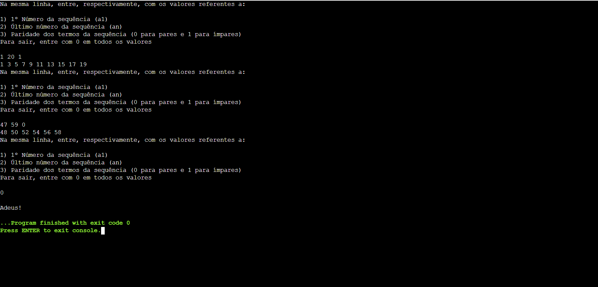

## Exercício 6

### Enunciado

Elaborar um programa que escreva em tela os números de 20 a 1, informando 
quando eles são pares e quando são ímpares, utilizando o comando for( ).

### Resolução em Python

#### Código

```py
while True:
    while True:
        try:
            vals = input("Na mesma linha, entre com os valores, respectivamente, referentes a:\n\n1) 1º termo da sequência (a1)\n2) Último termo da sequência (an)\n3) Razão da sequência (r)\nPara sair, entre com 0 em todos os valores\n\n").split()
            vals[0], vals[1], vals[2] = int(vals[0]), int(vals[1]), int(vals[2])
            break
        except:
            print ("*Número(s) inválido(s)... Tente novamente*")
    if vals[0] == vals[1] == vals[2] == 0:
        break
    if (vals[0] <= vals[1]):
        for vals[0] in range (vals[0], vals[1] + 1, vals[2]):
            print (f"{vals[0]} ", end="")
            if (vals[0] % 2 == 0):
                print ("é par")
            else:
                print ("é ímpar")
    else:
        for vals[0] in range (vals[0], vals[1] - 1, -vals[2]):
            print (f"{vals[0]} ", end="")
            if (vals[0] % 2 == 0):
                print ("é par")
            else:
                print ("é ímpar")
    print ()
print ("\nAdeus!")
```
#### Output

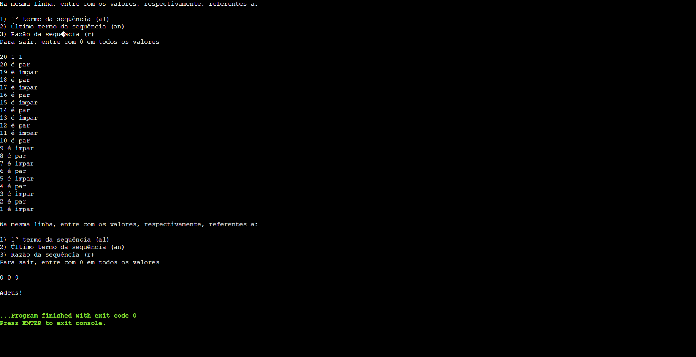

### Resolução em C

#### Código

```c
#include <stdio.h>
#include <stdlib.h>
#include <string.h>

int main() {
    for (;;) {
        char *dados = (char*)malloc(10 * sizeof (char));
        int vals[3] = {0, 0, 0};
        for (;;) {
            printf ("Na mesma linha, entre, respectivamente, com os valores referentes a:\n\n1) 1º Termo da sequência (a1)\n2) Último termo da sequência (an)\n3) Razão da sequência\nPara sair, entre com 0 em todos os valores\n\n");
            fgets (dados, 10, stdin);
            char *pt = strtok(dados, " ");
            int i = 0;
            while (pt != NULL) {
                vals[i] = atoi(pt);
                pt = strtok(NULL, " ");
                ++i;
            }
            if (vals[0] == 0 && vals[1] == 0 && vals[2] == 0) {
                break;
            }
            else if (vals[2] == 0) {
                printf ("*Número(s) inválidos... Tente novamente\n*");
            }
            else {
                break;
            }
        }
        if (vals[0] == 0 && vals[1] == 0 && vals[2] == 0) {
            break;
        }
        if (vals[0] <= vals[1]) {
            for (vals[0]; vals[0] <= vals[1]; vals[0] += vals[2]) {
                printf ("%d é ", vals[0]);
                if (vals[0] % 2 == 0) {
                    printf ("par\n");
                }
                else {
                    printf ("ímpar\n");
                }
            }
        }
        else {
            for (vals[0]; vals[0] >= vals[1]; vals[0] -= vals[2]) {
                printf ("%d é ", vals[0]);
                if (vals[0] % 2 == 0) {
                    printf ("par\n");
                }
                else {
                    printf ("ímpar\n");
                }
            }
        }
    }
    printf ("\nAdeus!");
    return 0;
}
```
#### Output

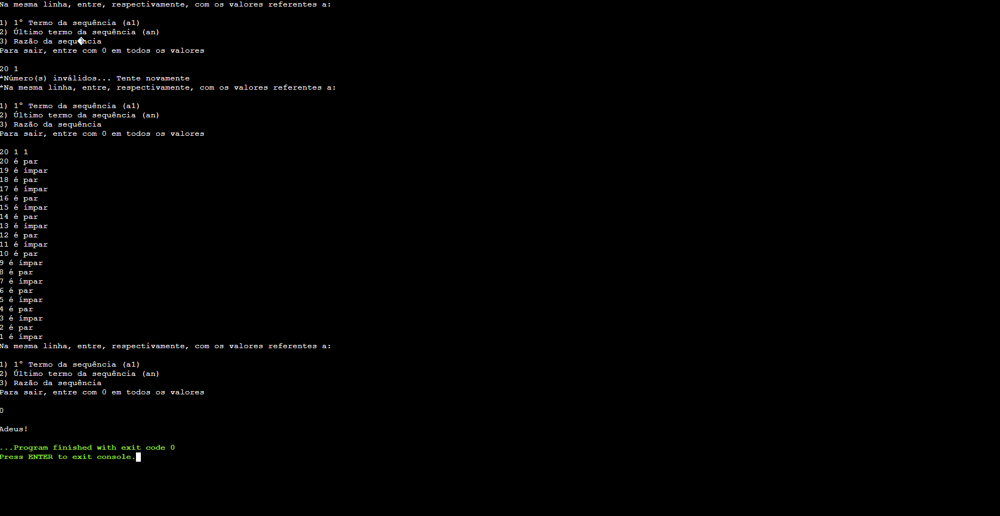

## Exercício 7

### Enunciado

Elaborar um programa que escreva em tela os números de 1 a 20, utilizando o 
comando do-while( ).

### Resolução em Python

#### Código

```py
while True:
    while True:
        try:
            vals = input("Na mesma linha, entre com os valores, respectivamente, referentes a:\n\n1) 1º termo da sequência (a1)\n2) Último termo da sequência (an)\n3) Razão da sequência (r)\nPara sair, entre com 0 em todos os valores\n\n").split()
            vals[0], vals[1], vals[2] = int(vals[0]), int(vals[1]), int(vals[2])
            break
        except:
            print ("*Número(s) inválido(s)... Tente novamente*")
    if vals[0] == vals[1] == vals[2] == 0:
        break
    print (f"Aqui estão os números de {vals[0]} até {vals[1]}, de {vals[2]} em {vals[2]}:")
    if vals[0] <= vals[1]:
        while True:
            print (f"{vals[0]} ", end="")
            vals[0] += vals[2]
            if not vals[0] <= vals[1]:
                break
    else:
        while True:
            print (f"{vals[0]} ", end="")
            vals[0] -= vals[2]
            if not vals[0] >= vals[1]:
                break
    print ()
print ("\nAdeus!")
```
#### Output

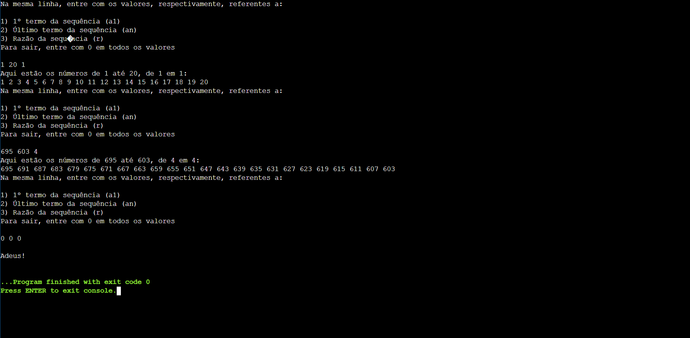

### Resolução em C

#### Código

```c
#include <stdio.h>
#include <stdlib.h>
#include <string.h>

int main() {
    for (;;) {
        char *dados = (char*)malloc(10 * sizeof (char));
        int vals[3] = {0, 0, 0};
        for (;;) {
            printf ("Na mesma linha, entre, respectivamente, com os valores referentes a:\n\n1) 1º Termo da sequência (a1)\n2) Último termo da sequência (an)\n3) Razão da sequência (r)\nPara sair, entre com 0 em todos os valores\n\n");
            fgets (dados, 10, stdin);
            char *pt = strtok(dados, " ");
            int i = 0;
            while (pt != NULL) {
                vals[i] = atoi(pt);
                pt = strtok(NULL, " ");
                ++i;
            }
            if (vals[0] == 0 && vals[1] == 0 && vals[2] == 0) {
                break;
            }
            else if (vals[2] == 0) {
                printf ("*Número(s) inválido(s)... Tente novamente\n*");
            }
            else {
                break;
            }
        }
        if (vals[0] == 0 && vals[1] == 0 && vals[2] == 0) {
            break;
        }
        printf ("Aqui estão os termos, na faixa de %d até %d, de %d em %d:\n", vals[0], vals[1], vals[2], vals[2]);
        if (vals[0] <= vals[1]) {
            do {
                printf ("%d ", vals[0]);
                vals[0] += vals[2];
            }
            while (vals[0] <= vals[1]);
        }
        else {
            do {
                printf ("%d ", vals[0]);
                vals[0] -= vals[2];
            }
            while (vals[0] >= vals[1]);
        }
        printf ("\n");
    }
    printf ("\nAdeus!");
    return 0;
}
```
#### Output

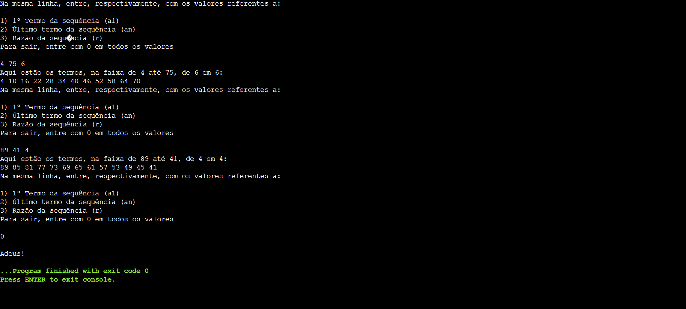

## Exercício 8

### Enunciado

Elaborar um programa que escreva em tela todos os números pares existentes 
entre 1 e 20, utilizando o comando do-while( ).

### Resolução em Python

#### Código

```py
while True:
    while True:
        try:
            vals = input("Na mesma linha, entre com os valores, respectivamente, referentes a:\n\n1) 1º termo da sequência (a1)\n2) Último termo da sequência (an)\n3) Divisibilidade dos termos\nPara sair, entre com 0 em todos os valores\n\n").split()
            vals[0], vals[1], vals[2] = int(vals[0]), int(vals[1]), int(vals[2])
            break
        except:
            print ("*Número(s) inválido(s)... Tente novamente*")
    if vals[0] == vals[1] == vals[2] == 0:
        break
    print (f"Aqui estão os termos divisíveis por {vals[2]}, de {vals[0]} até {vals[1]}:")
    if vals[0] < vals[1]:
        if vals[0] % vals[2] != 0:
            vals[0] -= vals[0] % vals[2] - vals[2]
        while True:
            print (f"{vals[0]} ", end="")
            vals[0] += vals[2]
            if not vals[0] <= vals[1]:
                break
    else:
        if vals[0] % vals[2] != 0:
            vals[0] -= vals[0] % vals[2]
        while True:
            print (f"{vals[0]} ", end="")
            vals[0] -= vals[2]
            if not vals[0] >= vals[1]:
                break
    print ("\n")
print ("\nAdeus!")
```
#### Output

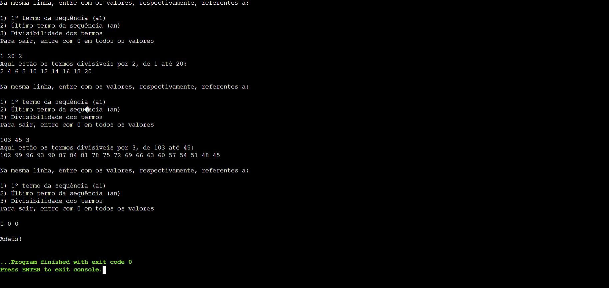

### Resolução em C

#### Código

```c
#include <stdio.h>
#include <stdlib.h>
#include <string.h>

int main() {

    for (;;) {
        char *dados = (char*)malloc(100 * sizeof(char));
        int vals[3] = {0, 0, 0};
        for (;;) {
            printf ("Na mesma linha, entre, respectivamente, com os valores referentes a:\n\n1) 1º Termo da sequência (a1)\n2) Último termo da sequência (an)\n3) Divisibilidade dos termos da sequência\nPara sair, entre com 0 em todos os valores\n\n");
            fgets (dados, 100, stdin);
            char *pt = strtok(dados, " ");
            int i = 0;
            while (pt != NULL) {
                vals[i] = atoi(pt);
                pt = strtok(NULL, " ");
                ++i;
            }
            if (vals[0] == 0 && vals[1] == 0 && vals[2] == 0) {
                break;
            }
            else if (vals[2] == 0) {
                printf ("*Número(s) inválido(s)... Tente novamente\n*");
            }
            else {
                break;
            }
        }
        if (vals[0] == 0 && vals[1] == 0 && vals[2] == 0) {
            break;
        }
        printf ("Aqui estão os termos divisíveis por %d, na faixa de %d até %d:\n", vals[2], vals[0], vals[1]);
        if (vals[0] <= vals[1]) {
            if (vals[0] % vals[2] != 0) {
                vals[0] -= vals[0] % vals[2] - vals[2];
            }
            do {
                printf ("%d ", vals[0]);
                vals[0] += vals[2];
            }
            while (vals[0] <= vals[1]);
        }
        else {
            if (vals[0] % vals[2] != 0) {
                vals[0] -= vals[0] % vals[2];
            }
            do {
                printf ("%d ", vals[0]);
                vals[0] -= vals[2];
            }
            while (vals[0] >= vals[1]);
        }
        printf ("\n");
    }
    printf ("\nAdeus!");
    return 0;
}
```
#### Output


## Exercício 9

### Enunciado

Elaborar um programa que escreva em tela os números de 1 a 20, informando 
quando eles são pares e quando são ímpares, utilizando o comando do-while( ).

### Resolução em Python

#### Código

```py
while True:
    while True:
        try:
            vals = input("Na mesma linha, entre com os valores, respectivamente, referentes a:\n\n1) 1º termo da sequência (a1)\n2) Último termo da sequência (an)\n3) Razão da sequência (r)\nPara sair, entre com 0 em todos os valores\n\n").split()
            vals[0], vals[1], vals[2] = int(vals[0]), int(vals[1]), int(vals[2])
            break
        except:
            print ("*Número(s) inválido(s)... Tente novamente*")
    if vals[0] == vals[1] == vals[2] == 0:
        break
    if (vals[0] <= vals[1]):
        while True:
            print (f"{vals[0]} ", end="")
            if (vals[0] % 2 == 0):
                print ("é par")
            else:
                print ("é ímpar")
            vals[0] += vals[2]
            if not vals[0] <= vals[1]:
                break
    else:
        while True:
            print (f"{vals[0]} ", end="")
            if (vals[0] % 2 == 0):
                print ("é par")
            else:
                print ("é ímpar")
            vals[0] -= vals[2]
            if not vals[0] >= vals[1]:
                break
    print ()
print ("\nAdeus!")
```
#### Output

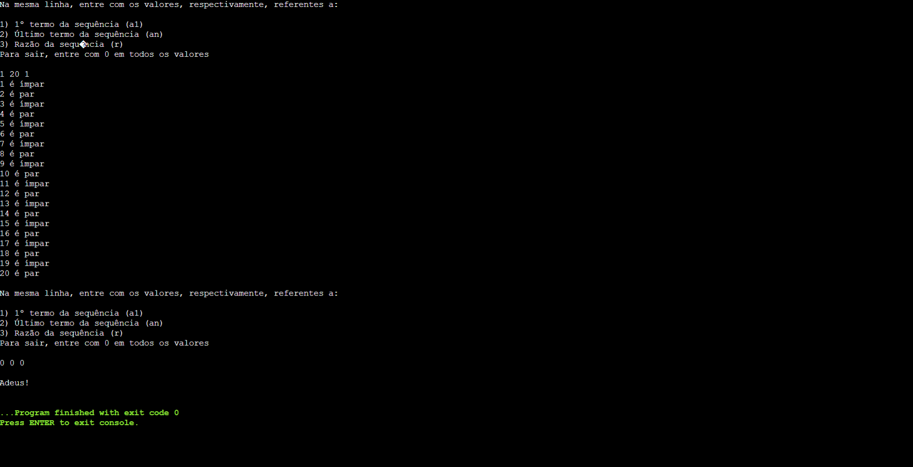

### Resolução em C

#### Código

```c
#include <stdio.h>
#include <stdlib.h>
#include <string.h>

int main() {
    for (;;) {
        char *dados = (char*)malloc(100 * sizeof(char));
        int vals[3] = {0, 0, 0};
        for (;;) {
            printf ("Na mesma linha, entre, respectivamente, com os valores referentes a:\n\n1) 1º Termo da sequência (a1)\n2) Último termo da sequência (an)\n3) Razão da sequência (r)\nPara sair, entre com 0 em todos os valores\n\n");
            fgets (dados, 100, stdin);
            char *pt = strtok(dados, " ");
            int i = 0;
            while (pt != NULL) {
                vals[i] = atoi(pt);
                pt = strtok(NULL, " ");
                ++i;
            }
            if (vals[0] == 0 && vals[1] == 0 && vals[2] == 0) {
                break;
            }
            else if (vals[2] == 0) {
                printf ("*Número(s) inválidos... Tente novamente\n*");
            }
            else {
                break;
            }
        }
        if (vals[0] == 0 && vals[1] == 0 && vals[2] == 0) {
            break;
        }
        if (vals[0] <= vals[1]) {
            do {
                printf ("%d é ", vals[0]);
                if (vals[0] % 2 == 0) {
                    printf ("par\n");
                }
                else {
                    printf ("ímpar\n");
                }
                vals[0] += vals[2];
            }
            while (vals[0] <= vals[1]);
        }
        else {
            do {
                printf ("%d é ", vals[0]);
                if (vals[0] % 2 == 0) {
                    printf ("par\n");
                }
                else {
                    printf ("ímpar\n");
                }
                vals[0] -= vals[2];
            }
            while (vals[0] >= vals[1]);
        }
        printf ("\n");
    }
    printf ("\nAdeus!");
    return 0;
}
```
#### Output

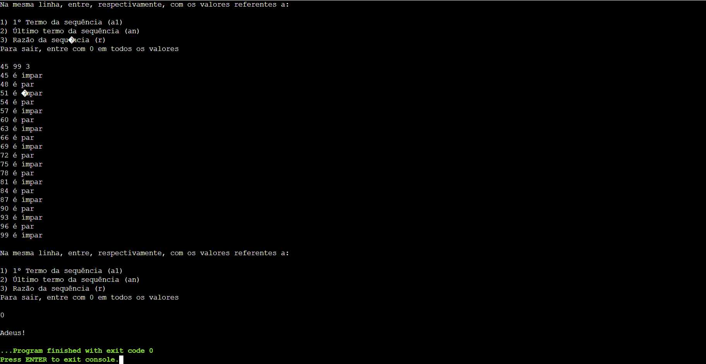

## Exercício 10

### Enunciado

Elaborar um programa que seja uma “Calculadora”, onde o usuário deverá digitar 
uma das seguintes teclas: ‘+’, ‘-‘, ‘*’, ‘/’ ou ‘S’. - Caso escolha ‘S’, para sair, o programa 
deverá ser encerrado; - Caso escolha ‘+’, ‘-‘, ‘*’ ou ‘/’, como operações aritméticas, o 
programa
deverá solicitar a digitação de dois números quaisquer (número a e número b), um por 
vez, realizar a respectiva operação aritmética (soma, subtração, multiplicação ou 
entre os respectivos números (a e b, nessa ordem)) e então apresentar o seu 
resultado. Após isto, deverá voltar à etapa inicial de digitação das teclas ‘+’, ‘-‘, ‘*’, ‘/’ 
ou ‘S’ e repetir este item até a digitação da tecla ‘S’.

### Resolução em Python

#### Código

```py
while True:
    while True:
        op = input("Escolha uma entre nossas operações suportadas:\n+  -  *  /  ^  S\nOperação = ")
        if op != "+" and op != "-" and op != "*" and op != "/" and op != "**" and op != "^" and op != "S" and op != "s":
            print ("Operação inválida... Tente novamente")
        else:
            break
    if op == "s" or op == "S":
        break
    while True:
        try:
            nums = input("Na mesma linha, entre com os dois número para a realização da operação escolhida:\n").split()
            nums[0], nums[1] = int(nums[0]), int(nums[1])
        except:
            print ("Número(s) inválido(s)... Tente novamente")
        else:
            break
    if op == "+":
        print ("{} + {} = {:.2f}\n" .format(nums[0], nums[1], nums[0] + nums[1]))
    elif op == "-":
        print ("{} - {} = {:.2f}\n" .format(nums[0], nums[1], nums[0] - nums[1]))
    elif op == "*":
        print ("{} * {} = {:.2f}\n" .format(nums[0], nums[1], nums[0] * nums[1]))
    elif op == "/":
        print ("{} / {} = {:.2f}\n" .format(nums[0], nums[1], nums[0] / nums[1]))
    elif op == "**" or op == "^":
        print ("{} ^ {} = {:.2f}\n" .format(nums[0], nums[1], nums[0] ** nums[1]))
print ("\nAdeus!")
```
#### Output

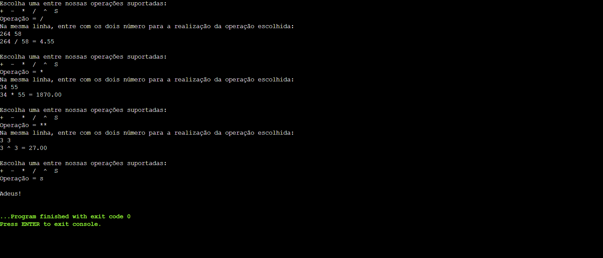

### Resolução em C

#### Código

```c
#include <stdio.h>
#include <stdlib.h>
#include <string.h>
#include <math.h>

int main() {
    for (;;) {
        char op[2];
        double vals[2] = {0, 0};
        for (;;) {
            printf ("Escolha uma de nossas operações suportadas:\n+  -  *  /  ^  S\nOP = ");
            scanf ("%s", op);
            getchar();
            if (op[0] != '+' && op[0] != '-' && op[0] != '*' && op[0] != '/' && op[0] != '^' && op[0] != 'S' && op[0] != 's') {
                printf ("*Operação inválida... Tente novamente*");
            }
            else {
                break;
            }
        }
        if (op[0] == 'S' || op[0] == 's') {
            break;
        }
        printf ("Na mesma linha, entre com os dois números para a realização da operação:\n");
        scanf ("%lf %lf", &vals[0], &vals[1]);
        if (op[0] == '+') {
            printf ("%.2lf + %.2lf = %.2lf\n\n", vals[0], vals[1], vals[0] + vals[1]);
        }
        else if (op[0] == '-') {
            printf ("%.2lf - %.2lf = %.2lf\n\n", vals[0], vals[1], vals[0] - vals[1]);
        }
        else if (op[0] == '*') {
            printf ("%.2lf * %.2lf = %.2lf\n\n", vals[0], vals[1], vals[0] * vals[1]);            
        }
        else if (op[0] == '/') {
            printf ("%.2lf / %.2lf = %.2lf\n\n", vals[0], vals[1], vals[0] / vals[1]);            
        }
        else if (op[0] == '^') {
            printf ("%.2lf ^ %.2lf = %.2lf\n\n", vals[0], vals[1], pow(vals[0], vals[1])); 
        }
    }
    printf ("\nAdeus!");
    return 0;
}
```
#### Output

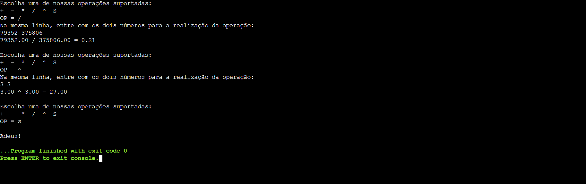

## Exercício 11

### Enunciado

Escreva um programa para mostrar na tela os resultados de uma tabuada de um 
número qualquer fornecido via teclado.
Exemplo:

Digite o número para a tabuada: 5 < Enter ><br>
Tabuada do 5:<br>
5 x 0 = 0<br>
5 x 1 = 5<br>
5 x 2 = 10<br>
5 x 3 = 15<br>
5 x 4 = 20<br>
5 x 5 = 25<br>
5 x 6 = 30<br>
5 x 7 = 35<br>
5 x 8 = 40<br>
5 x 9 = 45<br>
5 x 10 = 50

### Resolução em Python

#### Código

```py
while True:
    while True:
        try:
            vals = input("Na mesma linha, entre respectivamente com os valores referentes a:\n\n1) Número para a tabuada\n2) Índice inicial da tabuada\n3) Índice final da tabuada\nPara sair, entre com 0 em todos os valores\n\n").split()
            vals[0], vals[1], vals[2] = float(vals[0]), int(vals[1]), int(vals[2])
            break
        except:
            print ("*Número(s) inválido(s)... Tente novamente*")
    if (vals[0] == vals[1] == vals[2] == 0):
        break
    if (vals[1] <= vals[2]):
        for vals[1] in range(vals[1], vals[2] + 1):
            print("{:.2f} X {} = {:.2f}" .format(vals[0], vals[1], vals[0] * vals[1]))
    else:
        for vals[1] in range(vals[1], vals[vals[2]] - 1, -1):
            print("{:.2f} X {} = {:.2f}" .format(vals[0], vals[1], vals[0] * vals[1]))
    print ()
print ("\nAdeus!")
```

#### Output

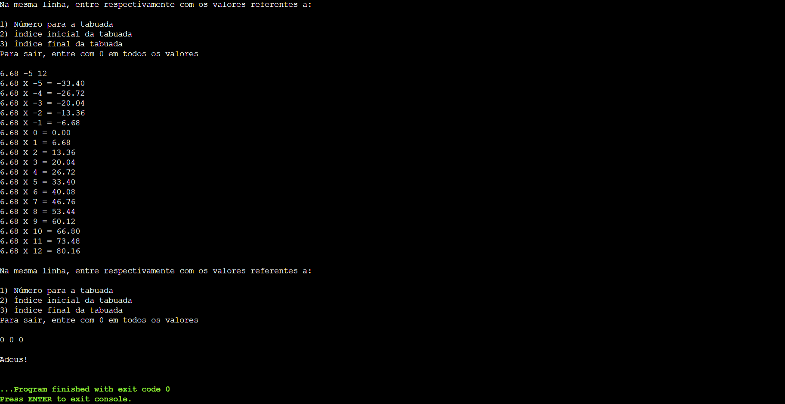

### Resolução em C

#### Código

```c
#include <stdio.h>
#include <stdlib.h>
#include <string.h>

int main() {
    for (;;) {
        char* dados = (char*)malloc(100 * sizeof(char));
        int vals[2] = {0, 0};
        double tab = 0;
        for (;;) {
            printf ("Na mesma linha, entre, respectivamente, com os valores referentes a:\n\n1) Número da tabuada (podendo ser decimal ou inteiro)\n2) Índice inicial da tabuada\n3) Índice final da tabuada\nPara sair, entre com 0 em todos os valores\n\n");
            fgets (dados, 100, stdin);
            char *pt = strtok(dados, " ");
            tab = atof(pt);
            int i = 0;
            while (pt != NULL) {
                pt = strtok(NULL, " ");
                vals[i] = atoi(pt);
                ++i;
            }
            if (vals[1] == 0 && tab != vals[0]) {
                printf ("*Número(s) inválidos... Tente novamente\n*");
            }
            break;
        }
        if (tab == 0 && vals[0] == 0 && vals[1] == 0) {
            break;
        }
        if (vals[0] < vals[1]) {
            for (vals[0]; vals[0] <= vals[1]; ++vals[0]) {
                printf ("%.2lf X %d = %.2lf\n", tab, vals[0], tab * vals[0]);
            }
        }
        else {
            for (vals[0]; vals[0] >= vals[1]; --vals[0]) {
                printf ("%.2lf X %d = %.2lf\n", tab, vals[0], tab * vals[0]);
            }
        }
        printf ("\n");
    }
    printf ("\nAdeus!");
    return 0;
}
```
#### Output

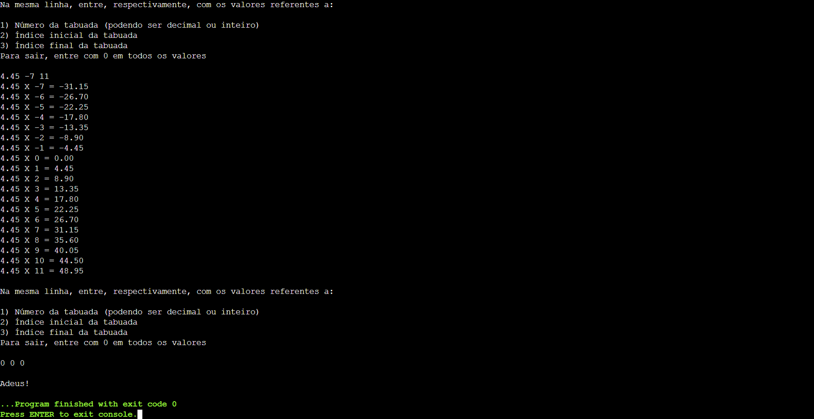

# Sala

## Exercício 1

### Enunciado

Exibir todos os valores numéricos inteiros ímpares situados na faixa de 0 a 
20. Para verificar se o número é ímpar, efetuar dentro da malha a verificação 
lógica dessa condição com a instrução SE, perguntando se o número é ímpar, 
sendo, exiba-o, não sendo, passe para o próximo passo.

### Resolução em Python

#### Código

```py
while True:
    while True:
        dados = input("Na mesma linha, entre, respectivamente, com os valores referentes a:\n\n1) 1º Número da sequência (a1)\n2) Último número da sequência (an)\n3) Razão da sequência (r)\nPara sair, entre com 0 em todos os valores\n\n").split()
        try:
            dados[0], dados[1], dados[2] = int(dados[0]), int(dados[1]), int(dados[2])
            break
        except:
            print ("Número(s) inválidos... Tente novamente")
    if dados[0] == dados[1] == dados[2] == 0:
        break
    print ("Os termos ímpares entre {} e {} são, de {} em {}:" .format(dados[0], dados[1], dados[2], dados[2]))
    for dados[0] in range (dados[0], dados[1] + 1, dados[2]):
        if (dados[0] % 2 != 0):
            print ("{} " .format(dados[0]), end="")
    print ()
print ("Adeus!")
```

#### Output

[output do exercício](Python/Sala/outputs/ex1.png)

### Resolução em C

#### Código

```c
#include <stdio.h>
#include <string.h>
#include <stdlib.h>
#include <stdbool.h>

int main() {
    
    for (;;) {
        char *dados = (char*)malloc(10 * sizeof (char));
        int vals[3] = {0, 0, 0};
        for (;;) {
            printf ("Na mesma linha, entre com os valores inteiros, respectivamente, referentes a:\n\n1) 1º Número (a1)\n2) Último Número (an)\n3) Razão da sequência (r)\nPara sair, entre com 0 em todos os valores\n\n");
            fgets (dados, 10, stdin);
            char *pt = strtok(dados, " ");
            int i = 0;
            while (pt != NULL) {
                vals[i] = atoi(pt);
                pt = strtok(NULL, " ");
                ++i;
            }
            if (vals[0] == 0 && vals[1] == 0 && vals[2] == 0) {
                break;
            }
            else if (vals[2] == 0) {
                printf ("*Número(s) inválido(s)... Tente novamente*");
            }
            else {
                break;
            }
        }
        if (vals[0] == 0 && vals[1] == 0 && vals[2] == 0) {
            break;
        }
        printf ("Aqui estão os números ímpares de %d até %d, de %d em %d:\n", vals[0], vals[1], vals[2], vals[2]);
        bool comp = false;
        if (vals[0] <= vals[1]) {
            while (vals[0] <= vals[1]) {
                if (vals[0] % 2 != 0) {
                    printf ("%d ", vals[0]);
                    comp = true;
                }
                vals[0] += vals[2];
            }
        }
        else {
            while (vals[0] >= vals[1]) {
                if (vals[0] % 2 != 0) {
                    printf ("%d ", vals[0]);
                    comp = true;
                }
                vals[0] -= vals[2];
            }
        }
        if (comp = false) {
            printf ("\nNão há números ímpares nesta sequência!\n\n");   
        }
        else {
            printf ("\n\n");
        }
    }
    printf ("\nAdeus!");
    return 0;
}
```
#### Output

[output do exercício](C/Sala/outputs/ex1.png)

## Exercício 2

### Enunciado

Exibir o total da soma obtido dos cem primeiros números inteiros 
(1+2+3+4+5+.....+97+98+99+100).

### Resolução em Python

#### Código

```py
while True:
    while True:
        try:
            a1, an, r = input("Na mesma linha, entre com os valores, respectivamente, referentes a:\n\n1) Primeiro valor da sequência (a1)\n2) Último valor da sequência (an)\n3) Razão da sequência (r)\nPara sair, entre com 0 em todos os valores\n\n").split()
            a1, an , r = int(a1), int(an), int(r)
            break
        except:
            print ("Número(s) inválidos... Tente novamente")
    if a1 == an ==  r == 0:
        break
    if a1 <= an:
        if a1 % r != 0:
            a1 -= a1 % r - r
        if an % r:
            an -= an % r
        print ("Sn = {}\n" .format((a1 + an) * ((an - a1) // 2 + 1)))
    else:
        if a1 % r != 0:
            a1 -= a1 % r
        if an % r:
            an -= an % r - r
        print ("Sn = {}\n" .format((a1 + an) * ((a1 - an) // 2 + 1)))
print ("Adeus")
```

#### Output

[output do exercício](Python/Sala/outputs/ex2.png)

### Resolução em C

#### Código

```c
#include <stdio.h>
#include <string.h>
#include <stdlib.h>

int main() {
    for (;;) {
        char * dados = (char*)malloc(10 * sizeof (char));
        int vals[3];
        for (;;) {
            printf ("Entre, na mesma linha, com os seguintes valores, respectivamente:\n\n1) 1º número da sequência (a1)\n2) Último número da sequência (an)\n3) Divisibilidade dos termos\nPara sair, entre com 0 em todos os valores\n\n");
            fgets(dados, 10, stdin);
            char *pt = strtok(dados, " ");
            int i = 0;
            while (pt != NULL) {
                vals[i] = atoi(pt);
                pt = strtok(NULL, " ");
                ++i;
            }
            if (vals[0] == 0 && vals[1] == 0 & vals[2] == 0) {
                break;
            }
            if (vals[2] == 0) {
                printf ("Número(s) inválidos... Tente novamente\n");
            }
            else {
                break;
            }
        }
        if (vals[0] == 0 && vals[1] == 0 & vals[2] == 0) {
            break;
        }
        if (vals[0] <= vals[1]) {
            if (vals[0] % vals[2] != 0) {
                vals[0] -= vals[0] % vals[2] - vals[2];
            }
            if (vals[1] % vals[2] != 0) {
                vals[1] -= vals[1] % vals[2];
            }
            printf ("Sn = %d\n\n", (vals[0] + vals[1]) * ((vals[1] - vals[0]) / vals[2] + 1) / 2);
        }
        else {
            if (vals[0] % vals[2] != 0) {
                vals[0] -= vals[0] % vals[2];
            }
            if (vals[1] % vals[2] != 0) {
                vals[1] -= vals[1] % vals[2] - vals[2];
            }
            printf ("Sn = %d\n\n", (vals[0] + vals[1]) * ((vals[0] - vals[1]) / vals[2] + 1) / 2);
        }
    }
    printf ("\nAdeus!");
    return 0;
}
```
#### Output

[output do exercício](C/Sala/outputs/ex2.png)

## Exercício 3

### Enunciado

Exibir os resultados de uma tabuada de um número qualquer. Essa deverá 
ser impressa no seguinte formato:
2 X 1 = 2<br>
2 X 2 = 4<br>
(...)<br>
2 X 10 = 20

### Resolução em Python

#### Código

```py
while True:
    while True:
        try:
            tab, index1, index2 = input("Na mesma linha, entre com os valores, respectivamente, referentes a:\n\n1) Valor da tabuada (podendo incluir valores decimais)\n2) Índice inicial da tabuada\n3) Índice final da tabuada\nPara sair, entre com 0 em todos os valores\n\n").split()
            tab, index1, index2 = float(tab), int(index1), int(index2)
            break
        except:
            print ("*Número(s) inválido(s)... Tente novamente*")
    if tab == index1 == index2 == 0:
        break
    for index1 in range (index1, index2 + 1):
        print ("{:.2f} X {} = {:.2f}" .format(tab, index1, tab * index1))
print ("\nAdeus")
```

#### Output

[output do exercício](Python/Sala/outputs/ex3.png)

### Resolução em C

#### Código

```c
#include <stdio.h>
#include <stdlib.h>
#include <string.h>

int main() {
    for (;;) {
        char *dados = (char*)malloc(100 * sizeof(char));
        double tab = 0;
        int index1, index2 = 0;
        for (;;) {
            printf ("Na mesma linha, entre com os valores referentes a:\n\n1) Número da tabuada (pode ser decimal ou inteiro)\n2) Índice inicial da tabuada\n3) Índice final da tabuada\nPara sair, entre com 0 em todos os valores\n\n");
            fgets (dados, 100, stdin);
            char *pt = strtok(dados, " ");
            tab = atof(pt);
            pt = strtok(NULL, " ");
            index1 = atoi(pt);
            pt = strtok(NULL, " ");
            index2 = atoi(pt);
            break;
        }
        if (tab == 0 && index1 == 0 && index2 == 0) {
            break;
        }
        if (index1 <= index2) {
            for (index1; index1 <= index2; ++index1) {
                printf ("%.2f X %d = %.2f\n", tab, index1, tab * index1);
            }
        }
        else {
            for (index1; index1 >= index2; --index1) {
                printf ("%.2f X %d = %.2f\n", tab, index1, tab * index1);
            } 
        }
        printf ("\n\n");
    }
    printf ("\nAdeus!");
    return 0;
}
```
#### Output

[output do exercício](C/Sala/outputs/ex3.png)

## Exercício 4

### Enunciado

Ler um número N qualquer menor ou igual a 50 e exibir o valor obtido da 
multiplicação sucessiva de N por 3 enquanto o produto for menor que 250 (N*3, 
N*3*3, N*3*3*3, etc.)

### Resolução em Python

#### Código

```py
while True:
    while True:
        vals = input("Na mesma linha, entre, respectivamente, com os valores referentes a:\n\n1) Número N\n2) Base da multiplicação sucessiva\n3) Índice do produto\nPara sair, entre com 0 em todos os valores\n\n").split()
        try:
            vals[0], vals[1], vals[2] = int(vals[0]), int(vals[1]), int(vals[2])
            break
        except:
            print ("*Número(s) inválido(s)... Tente novamente*")
    if vals[0] == vals[1] == vals[2] == 0:
        break
    i = 1
    while True:
        if (vals[0] * vals[1] ** i >= vals[2]):
            break
        print ("{} * {} ^ {} = {}" .format(vals[0], vals[1], i, vals[0] * vals[1] ** i))
        i += 1
    print ()
print ("\nAdeus!")
```

#### Output

[output do exercício](Python/Sala/outputs/ex4.png)

### Resolução em C

#### Código

```c
#include <stdio.h>
#include <stdio.h>
#include <stdlib.h>
#include <string.h>
#include <math.h>

int main() {
    for (;;) {
        char *dados = (char *)malloc(100 * sizeof (char));
        int n = 0, mult = 0;
        unsigned long long stop = 0, result = 0;
        for (;;) {
            printf ("Na mesma linha, entre, respectivamente, com os valores referentes a:\n\n1) Valor de N\n2) Valor da multiplicação sucessiva\n3) Número de parada\n\n");
            fgets(dados, 100, stdin);
            char *pt = strtok(dados, " ");
            int i = 0;
            while (pt != NULL) {
                if (i == 0) {
                    n = atoi(pt);
                }
                else if (i == 1) {
                    mult = atoi(pt);
                }
                else {
                    stop = atoi(pt);
                }
                pt = strtok(NULL, " ");
                ++i;
            }
            if (n == 0 && mult == 0 && stop == 0) {
                break;
            }
            else if (mult == 0) {
                printf ("*Número(s) inválido(s)... Tente novamente*\n");
            }
            else {
                break;
            }
        }
        if (n == 0 && mult == 0 && stop == 0) {
            break;
        }
        for (int i = 1;; ++i) {
            result = n * pow(mult, i);
            if (result >= stop) {
                break;
            }
            printf ("%d * %d ^ %d = %llu\n", n, mult, i, result);
        }
    }
    printf ("\nAdeus!");
    return 0;
}
```
#### Output

[output do exercício](C/Sala/outputs/ex4.png)

## Exercício 5

### Enunciado

Exibir todos os números divisíveis por 4 que sejam menores que 200. Use a 
instrução Se dentro da malha do programa. A variável Contador deverá iniciar 
com o valor 1.

### Resolução em Python

#### Código

```py
while True:
    while True:
        try:
            div, index = input("Na mesma linha, entre com os valores, respectivamente, referentes a:\n\n1) Índice de divisibilidade\n2) Número de parada\nPara sair, entre com 0 em todos os valores\n\n").split()
            div, index = int(div), int(index)
            break
        except:
            print ("Número(s) inválido(s)... Tente novamente")
    if div == index == 0:
        break
    print ("Aqui estão os números divisíveis por {} que são menores ou iguais a {}:" .format(div, index))
    for i in range (div, index + 1, div):
        print ("{} " .format(i), end='')
    print ("\n")
print ("\nAdeus!")
```

#### Output

[output do exercício](Python/Sala/outputs/ex5.png)

### Resolução em C

#### Código

```c
#include <stdio.h>
#include <string.h>
#include <stdlib.h>

int main() {
    for (;;) {
        char *dados = (char*)malloc(20 * sizeof (char));
        int val = 0, index = 0;
        for (;;) {
            printf ("Entre, na mesma linha, com os valores, respectivamente, referentes a:\n\n1) Valor de divisibilidade\n2) Índice do programa\n\n");
            fgets (dados, 20, stdin);
            char *pt = strtok(dados, " ");
            val = atoi(pt);
            pt = strtok(NULL, " ");
            index = atoi(pt);
            if (val == 0 && index != 0 || index == 0 && val != 0) {
                printf ("*Número(s) inválido(s)... Tente novamente*\n");
            }
            else {
                break;
            }
        }
        if (val == 0 && index == 0) {
            break;
        }
        printf ("Aqui estão os números n divisíveis por %d, tal que n < %d:\n", val, index);
        int cont = 1;
        for (cont = val; cont <= index; cont += val) {
            printf ("%d ", cont);
        }
        printf ("\n\n");
    }
    printf ("\nAdeus!");
    return 0;
}
```
#### Output

[output do exercício](C/Sala/outputs/ex5.png)

## Exercício 6

### Enunciado

Exibir os quadrados dos números inteiros de 15 a 200.

### Resolução em Python

#### Código

```py
while True:
    while True:
        try:
            dados = input("Na mesma linha, entre, respectivamente, com os valores referentes a:\n\n3) Índice da potência\n2) Base inicial\n3) Base final\n4) Razão da sequência (r)\n\nPara sair, entre com 0 para os dois valores\n\n").split()
            dados[0], dados[1], dados[2], dados[3] = int(dados[0]), int(dados[1]), int(dados[2]), int(dados[3])
            break
        except:
            print ("*Número(s) inválidos... Tente novamente*")
    if dados[0] == dados[1] == dados[2] == dados[3] == 0:
        break
    if (dados[1] <= dados[2]):
        for dados[1] in range (dados[1], dados[2] + 1, dados[3]):
            print ("{} ^ {} = {}" .format(dados[1], dados[0], dados[1] ** dados[0]))
    else:
        for dados[1] in range (dados[1], dados[2] - 1, -dados[3]):
            print ("{} ^ {} = {}" .format(dados[1], dados[0], dados[1] ** dados[0]))
    print ()
print ("\nAdeus!")
```

#### Output

[output do exercício](Python/Sala/outputs/ex6.png)

### Resolução em C

#### Código

```c
#include <stdio.h>
#include <stdlib.h>
#include <string.h>
#include <math.h>

int main() {
    for (;;) {
        char *dados = (char*)malloc(20 * sizeof (char));
        int vals[4] = {0, 0, 0, 0};
        for (;;) {
            printf ("Na mesma linha, entre com os valores, respectivamente, referentes a:\n\n1) Índice da potência\n2) Base inicial\n3) Base final\n4) Razão da sequência\nPara sair, entre com 0 em todos os valores\n\n");
            fgets (dados, 20, stdin);
            char *pt = strtok(dados, " ");
            int  i = 0;
            while (pt != NULL) {
                vals[i] = atoi(pt);
                pt = strtok(NULL, " ");
                ++i;
            }
            if (vals[0] == 0 && vals[1] == 0 & vals[2] == 0 && vals[3] == 0) {
                break;
            }
            else if (vals[3] == 0) {
                printf ("*Número(s) inválido(s)... Tente novamente*\n");
            }
            else {
                break;
            }
        }
        if (vals[0] == 0 && vals[1] == 0 & vals[2] == 0 && vals[3] == 0) {
            break;
        }
        unsigned long long result;
            if (vals[1] <= vals[2]) {
                for (vals[1]; vals[1] <= vals[2]; vals[1] += vals[3]) {
                    result = pow(vals[1], vals[0]);
                    printf ("%d ^ %d = %llu\n", vals[1], vals[0], result);
                }
            }
            else {
                for (vals[1]; vals[1] >= vals[2]; vals[1] -= vals[3]) {
                    result = pow(vals[1], vals[0]);
                    printf ("%d ^ %d = %llu\n", vals[1], vals[0], result);
                }
            }
            printf ("\n");
    }
    printf ("\nAdeus!");
    return 0;
}
```
#### Output

[output do exercício](C/Sala/outputs/ex6.png)

## Exercício 7

### Enunciado

Exibir as potencias e 3 variando de 0 a 15. Deve ser considerado que 
qualquer número elevado a zero é 1 e elevado a 1 é ele mesmo.

3 elevado a 0 = 1<br>
3 elevado a 1 = 3<br>
(...)<br>
3 elevado a 15 = 14348907

### Resolução em Python

#### Código

```py
while True:
    while True:
        try:
            dados = input("Na mesma linha, entre, respectivamente, com os valores referentes a:\n\n1) Nº da Base\n2) Índice inicial\n3) Índice final\n\nPara sair, entre com 0 para os dois valores\n\n").split()
            dados[0], dados[1], dados[2] = int(dados[0]), int(dados[1]), int(dados[2])
            break
        except:
            print ("*Número(s) inválidos... Tente novamente*")
    if dados[0] == dados[1] == dados[2] == 0:
        break
    if (dados[1] <= dados[2]):
        for dados[1] in range (dados[1], dados[2] + 1):
            print ("{} ^ {} = {}" .format(dados[0], dados[1], dados[0] ** dados[1]))
    else:
        for dados[1] in range (dados[1], dados[2] - 1):
            print ("{} ^ {} = {}" .format(dados[0], dados[1], dados[0] ** dados[1]))
    print ()
print ("\nAdeus!")
```

#### Output

[output do exercício](Python/Sala/outputs/ex7.png)

### Resolução em C

#### Código

```c
#include <stdio.h>
#include <stdlib.h>
#include <string.h>
#include <math.h>

int main() {
    for (;;) {
        char *dados = (char*)malloc(10 * sizeof (char));
        int vals[3] = {0, 0, 0};
        unsigned long long result = 0;
        for (;;) {
            printf ("Entre, na mesma linha, com os valores, respectivamente, referentes a:\n\n1) Valor da base \n2) Índice inicial da potência\n3) Índice final da potência\nPara sair, entre com 0 em todos os valores\n\n");
            fgets (dados, 10, stdin);
            char *pt = strtok(dados, " ");
            int i = 0;
            while (pt != NULL) {
                vals[i] = atoi(pt);
                pt = strtok(NULL, " ");
                ++i;
            }
            break;
        }
        if (vals[0] == 0 && vals[1] == 0 && vals[2] == 0) {
            break;
        }
        if (vals[1] <= vals[2]) {
            for (vals[1]; vals[1] <= vals[2]; ++vals[1]) {
                result = pow(vals[0], vals[1]);
                if (vals[1] > 0 && result == 0) {
                    printf ("Perdão! A variável teve um aneurisma... Quero dizer, as variáveis em C não têm memória infinita...");
                    break;
                }
                else if (vals[1] < 0 || vals[2] < 0) {
                    printf ("%d ^ %d = %.5lf\n", vals[0], vals[1], pow(vals[0] , vals[1]));
                }
                else {
                    printf ("%d ^ %d = %llu\n", vals[0], vals[1], result);
                }
            }
        }
        else {
            for (vals[1]; vals[1] >= vals[2]; --vals[1]) {
                result = pow(vals[0], vals[1]);
                if (vals[1] > 0 && result == 0) {
                    printf ("Perdão! A variável teve um aneurisma... Quero dizer, as variáveis em C não têm memória infinita...");
                    break;
                }
                else if (vals[1] < 0 || vals[2] < 0) {
                    printf ("%d ^ %d = %.5lf\n", vals[0], vals[1], pow(vals[0] , vals[1]));
                }
                else {
                    printf ("%d ^ %d = %llu\n", vals[0], vals[1], result);
                }
            }
        }
        printf ("\n");
    }
    printf ("\nAdeus!");
    return 0;
}
```
#### Output

[output do exercício](C/Sala/outputs/ex7.png)

## Exercício 8

### Enunciado

Crie um programa que exiba a série de Fibonacci até o décimo quinto 
termo. A série de Fibonacci é formada pela seqüência: 1, 1, 2, 3, 5, 8, 13, 21, 
34....etc. Essa série se caracteriza pela soma de um termo posterior com seu 
anterior subseqüente.

### Resolução em Python

#### Código

```py
def fibonacci(x1, x2):
    n = 1
    ant = 1
    antsuc = 0
    for i in range(1, x2 + 1):
        if i >= x1: 
            print ("{}º = {}" .format(i, n))
        n = ant + antsuc
        antsuc = ant
        ant = n
while True:
    while True:
        try:
            x1, x2 = input("Na mesma linha, entre, respectivamente com os índices para a Sequência de Fibonacci\n\n1) Índice inicial (a1)\n2) Índice final (an | an > a1)\nPara encerrar o programa, entre com 0 para os dois valores\n\n").split()
            x1, x2 = int(x1), int(x2)
            break
        except ValueError:
            print ("*Número(s) inválido(s), tente novamente*")
    if x1 == x2 == 0:
        break
    x1, x2 = int(x1), int(x2)
    fibonacci(x1, x2)
print ("\nAdeus!")
```

#### Output

[output do exercício](Python/Sala/outputs/ex8.png)

### Resolução em C

#### Código

```c
#include <stdio.h>
#include <stdlib.h>
#include <string.h>

void fibonacci(int i1, int i2) {
    unsigned long long x = 1, ant = 1, antsuc = 0;
    for (int i = 1; i <= i2; ++i) {
        if (i >= i1) {
            printf ("%dº = %llu\n", i, x);   
        }
        x = ant + antsuc;
        antsuc = ant;
        ant = x;
    }
    printf ("\n");
}

int main() {
    for (;;) {
        char *dados = (char*)malloc(50 * sizeof (char));
        long n1 = 0, n2 = 0;
        for (;;) {
            printf ("Na mesma linha, entre com os valores, repectivamente, referentes a:\n\n1) Índice inicial da sequência (i1)\n2) Índice final da sequência (in | in >= i1)\nPara sair, entre com 0 em todos os valores\n\n");
            fgets (dados, 50, stdin);
            char *pt = strtok(dados, " ");
            n1 = atoi(pt);
            pt = strtok(NULL, " ");
            n2 = atoi(pt);
            if (n1 == 0 && n2 != 0 || n2 == 0 && n1 != 0) {
                printf ("*Número(s) inválido(s)... Tente novamente*\n");
            }
            else {
                break;
            }
        }
        if (n1 == 0 && n2 == 0) {
            break;
        }
        fibonacci(n1, n2);
    }
    printf ("\nAdeus!");
    return 0;
}
```
#### Output

[output do exercício](C/Sala/outputs/ex8.png)

## Exercício 9

### Enunciado

Crie um programa que apresente o valor de uma potência de uma base 
qualquer elevada a um expoente qualquer, ou seja, de N elevado a M.

### Resolução em Python

#### Código

```py
while True:
    while True:
        try:
            base, index = input("Na mesma linha, entre, respectivamente, com os valores referentes a:\n\n1) Base\n2) Índice do expoente\nPara sair, entre com 0 em todos os valores\n\n").split()
            base, index = int(base), int(index)
            break
        except ValueError:
            print ("*Número(s) inválido(s)... Tente novamente*")
    if base == index == 0:
        break
    print ("{} ^ {} = {}\n" .format(base, index, base ** index))
print ("\nAdeus!")
```

#### Output

[output do exercício](Python/Sala/outputs/ex9.png)

### Resolução em C

#### Código

```c
#include <stdio.h>
#include <stdlib.h>
#include <string.h>
#include <math.h>

int main() {
    for (;;) {
        char *dados = (char*)malloc(10 * sizeof (char));
        int base, index;
        unsigned long long result;
        for (;;) {
            printf ("Entre, na mesma linha, com os valores, respectivamente, referentes a:\n\n1) Base\n2) Expoente\nPara sair, entre com 0 em todos os valores\n\n");
            fgets(dados, 10, stdin);
            char *pt = strtok(dados, " ");
            base = atoi(pt);
            pt = strtok(NULL, " ");
            index = atoi(pt);
            break;
        }
        result = pow(base, index);
        if (index == 0 && base == 0) {
            break;
        }
        if (index > 0 && result == 0) {
            printf ("Ops, parece que a variável infartou. As variáveis em C não têm memória infinita...\n");
        }
        else if (index < 0) {
            printf ("%d ^ %d = %.5lf\n", base, index, pow(base, index));
        }
        else {
            printf ("%d ^ %d = %llu\n", base, index, result);
        }
    }
    printf ("\nAdeus!");
    return 0;
}
```
#### Output

[output do exercício](C/Sala/outputs/ex9.png)

## Exercício 10

### Enunciado

Crie um programa que exiba no final o somatório dos valores pares 
existentes na faixa de 1 até 500.

### Resolução em Python

#### Código

```py
while True:
    while True:
        try:
            dados = input("Entre, na mesma linha, com os valores, respectivamente, referentes a:\n\n1) Paridade dos termos da sequência (0 se forem pares e 1 se forem ímpares)\n2) 1º Termo da sequência\n2) Último termo da sequência\nPara sair, entre com 0 em todos os valores\n\n").split()
            dados[0], dados[1], dados[2] = int(dados[0]), int(dados[1]), int(dados[2])
            break
        except ValueError:
            print ("Número(s) inválido(s)... Tente novamente")
    if dados[0] == dados[1] == dados[2] == 0:
        break
    if dados[0] == 0:
        print (f"A soma dos números pares, entre {dados[1]} e {dados[2]} é ", end='')
    else:
        print (f"A soma dos números ímpares, entre {dados[1]} e {dados[2]} é ", end='')
    if dados[0] == 0 and dados[1] % 2 != 0 or dados[0] == 1 and dados[1] % 2 == 0:
        dados[1] += 1
    if dados[0] == 0 and dados[2] % 2 != 0 or dados[0] == 1 and dados[2] % 2 == 0:
        dados[2] -= 1
    print((dados[1] + dados[2]) * ((dados[2] - dados[1]) // 2 + 1) // 2)
print ("\nAdeus")
```

#### Output

[output do exercício](Python/Sala/outputs/ex10.png)

### Resolução em C

#### Código

```c
#include <stdio.h>
#include <stdlib.h>
#include <string.h>

int main() {
    for (;;) {
        char *dados = (char*)malloc(10 * sizeof (char));
        int vals[3] = {0, 0, 0};
        for (;;) {
            printf ("Na mesma linha, entre com os valores, respectivamente, referentes a:\n\n1) Divisibilidade por 2 dos termos da sequência: 0 se os termos forem pares e 1 se os valores forem ímpares\n2) Primeiro número da sequência (a1)\n3) Último número da sequência (an)\nPara sair, entre com 0 em todos os valores\n\n");
            fgets(dados, 10, stdin);
            char *pt = strtok(dados, " ");
            int i = 0;
            while (pt != NULL) {
                vals[i] = atoi(pt);
                pt = strtok(NULL, " ");
                ++i;
            }
            if (vals[0] == 0 && vals[1] == 0 && vals[2] == 0) {
                break;
            }
            else if (vals[0] != 0 && vals[0] != 1) {
                printf ("Número(s) inválidos... Tente novamente");
            }
            else {
                break;
            }
        }
        if (vals[0] == 0 && vals[1] == 0 && vals[2] == 0) {
            break;
        }
        if (vals[0] == 0) {
            printf ("A soma dos valores pares entre %d e %d é ", vals[1], vals[2]);
        }
        else {
            printf ("A soma dos valores ímpares entre %d e %d é ", vals[1], vals[2]);
        }
        if ((vals[0] == 0 && vals[1] % 2 != 0) || (vals[0] == 1 && vals[1] % 2 == 0)) {
            if (vals[1] <= vals[2]) {
                vals[1] += 1;
            }
            else {
                vals[1] -= 1;
            }
        }
        if ((vals[0] == 0 && vals[2] % 2 != 0) || (vals[0] == 1 && vals[2] % 2 == 0)) {
            if (vals[2] > vals[1]) {
                vals[2] -= 1;   
            }
            else {
                vals[2] += 1;
            }
        }
        if (vals[1] <= vals[2]) {
            printf ("%d\n\n", (vals[1] + vals[2]) * ((vals[2] - vals[1]) / 2 + 1) / 2);
        }
        else {
            printf ("%d\n\n", (vals[1] + vals[2]) * ((vals[1] - vals[2]) / 2 + 1) / 2);
        }
    }
    printf ("\nAdeus!");
    return 0;
}
```
#### Output

[output do exercício](C/Sala/outputs/ex10.png)

## Exercício 11

### Enunciado

Ler 5 números inteiros e identificar o maior e o menor valor, exibir os 
mesmos.

### Resolução em Python

#### Código

```py
while True:
    while True:
        try:
            nums = input("Na mesma linha, entre com os números que desejar\nIrei dizer qual é o maior e o menor\nPara sair, entre com apenas um 0\n\n").split()
            nums = [int(i) for i in nums]
            break
        except ValueError:
            print ("Número(s) inválido(s)... Tente novamente")
    if len(nums) == 1 and nums[0] == 0:
        break
    print ("Maior = {}\nMenor = {}\n" .format(max(nums), min(nums)))
print ("\nAdeus!")
```

#### Output

[output do exercício](Python/Sala/outputs/ex11.png)

### Resolução em C

#### Código

```c
#include <stdio.h>
#include <stdlib.h>
#include <string.h>

int main() {
    for (;;) {
        char *nums = (char*)malloc(100 * sizeof (char));
        printf ("Na mesma linha, entre com os números inteiros, que eu irei dizer qual é o maior e o menor número\nPara sair, entre com 0\n\n");
        fgets (nums, 100, stdin);
        char *pt = strtok(nums, " ");
        int maior = atoi(pt), menor = atoi(pt);
        while (pt != NULL) {
            if (atoi(pt) > maior) {
                maior = atoi(pt);
            }
            if (atoi(pt) < menor) {
                menor = atoi(pt);
            }
            pt = strtok(NULL, " ");
        }
        if (maior == 0 && menor == 0) {
            break;
        }
        printf ("Maior valor = %d\nMenor valor = %d\n\n", maior, menor);
    }
    printf ("\nAdeus");
    return 0;
}
```
#### Output

[output do exercício](C/Sala/outputs/ex11.png)

# Agradecimentos

Se você chegou até aqui, obrigado pela paciência em analisar e avaliar meus códigos.

Caso tenha alguma sugestão de pauta, não hesite em me contatar e expor o seu ponto.

Até a próxima lista.

Continue aprendendo.

Abraços,

Raphael Vicente.